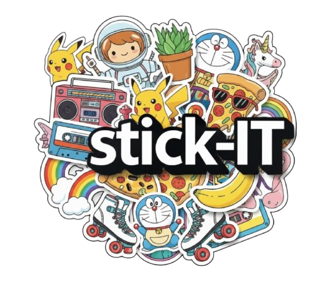
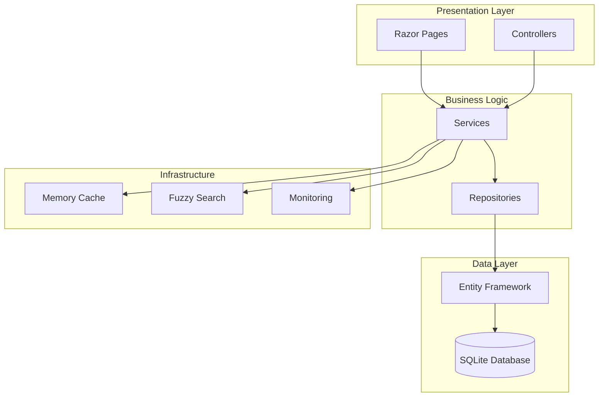

# 🏷️ StickIt - Sticker eCommerce Portfolio Project

[](https://github.com/Velyene/StickIt/actions)
[](docs/DEPLOYMENT.md)

> ASP.NET Core e-commerce platform for custom stickers.

## ✨ Key Features

- Product catalog with search and filtering
- Shopping cart and checkout flows
- User accounts, profiles, addresses, and order history
- Ratings and reviews
- Admin, manager, and staff workflows
- Accessibility-conscious responsive UI
- Dockerized local environment
- Unit and integration test infrastructure with measured coverage reporting

### 🛒 **Core eCommerce**
- **Product Catalog** - Advanced search with fuzzy matching and filtering
- **Shopping Cart** - Real-time cart management with session persistence  
- **Order Management** - Complete order lifecycle with status tracking
- **User Accounts** - Registration, profiles, address book, order history

### 🔐 **Security & Authentication**
- **ASP.NET Core Identity** - Secure user authentication and authorization
- **Role-based Access** - Admin, Manager, Staff, Customer roles
- **Security Middleware** - Rate limiting, CORS, and data protection

### ⚡ **Performance & Scalability**
- **Optimized Database** - SQLite with EF Core 10 and query optimization
- **Image Processing** - Automatic image optimization and compression
- **Caching Strategy** - In-app caching to support common storefront flows
- **Background Services** - Async processing for heavy operations

### 📊 **Monitoring & Observability**
- **Application Insights** - Telemetry integration present in the application
- **Prometheus Metrics** - Metrics endpoints and related code paths are included
- **Health Checks** - Database and service health endpoints are configured
- **Structured Logging** - Application logging support is built into the project

### 🎨 **Modern Architecture**
- **Layered Design** - Decomposed controllers and separation of concerns
- **Dependency Injection** - Service registration across application layers
- **Dockerized Setup** - Container support and deployment documentation

## 🖼️ Screenshots

| Surface | Preview |
|---------|---------|
| App logo |  |
| Landing page artwork |  |

## 🏗️ Architecture Overview



### Controller Architecture
- **UserProfileController** - Dashboard, profile management, avatar upload
- **UserAddressController** - Address book CRUD operations
- **UserReviewController** - Product ratings and store testimonials
- **AdminUserController** - User management and role administration
- **AdminAnalyticsController** - Sales analytics and business intelligence
- **AdminSystemController** - System management and maintenance

## 🚀 Quick Start

### Prerequisites
- **[.NET 10 SDK](https://dotnet.microsoft.com/download)** - Pinned via `global.json` to `10.0.300`
- **[Visual Studio 2026](https://visualstudio.microsoft.com/)** - Community, Professional, or Enterprise
- **[Docker Desktop](https://www.docker.com/products/docker-desktop)** - For containerized deployment
- **[Git](https://git-scm.com/)** - Version control

### Local Development Setup

1. **Clone the Repository**
   ```bash
   git clone https://github.com/Velyene/StickIt.git
   cd StickIt
   ```

2. **Restore Dependencies**
   ```bash
   dotnet restore
   ```

3. **Setup Database**
   ```bash
   # Apply migrations and seed test data
   dotnet ef database update --project ELKH
   ```

4. **Run the Application**
   ```bash
   dotnet run --project ELKH
   ```

5. **Access the Application**
   - **Main Site**: http://localhost:5000
   - **HTTPS**: https://localhost:5001
   - **Health Checks**: http://localhost:5000/health

### Docker Development (supported local container path)

```bash
# Optional: create a local environment file for secrets and overrides
copy .env.example .env

# Build and run the app with SQLite only
docker compose up --build

# View logs
docker compose logs -f elkh-app

# Stop containers
docker compose down
```

This local Docker setup runs a single app container backed by the repository's SQLite files.
PostgreSQL, Redis, Grafana, Prometheus, and Nginx are not required for the supported local happy path.

After startup, open:
- **Main Site**: http://localhost:8080
- **Health Checks**: http://localhost:8080/health

## 🧪 Testing

### Run All Tests
```bash
# Unit and integration tests with coverage artifact generation
dotnet test --collect:"XPlat Code Coverage"

# Run specific test category
dotnet test --filter Category=Unit
```

### Generate Coverage Report
```bash
# Install ReportGenerator (one-time)
dotnet tool install -g dotnet-reportgenerator-globaltool

# Generate HTML coverage report
reportgenerator -reports:"./TestResults/**/coverage.cobertura.xml" -targetdir:"./CoverageReport" -reporttypes:Html
```

**Latest measured coverage artifact:**
- Full-suite artifact: `TestResults/db821130-2eea-4277-96a3-df73b9af58d7/coverage.cobertura.xml`
- Line coverage: `17.94%`
- Branch coverage: `9.71%`

This is the current measured baseline from the repository's full `ELKH.Tests` coverage run. The broader suite still contains failing integration tests, so treat these numbers as the latest captured evidence rather than a stability badge.

## 📦 Deployment

### Docker Workflow

```bash
# Build production image
docker build -f Dockerfile -t stickit-web:latest .

# Run production stack
docker compose -f docker-compose.prod.yml up -d
```

### Azure Deployment

```bash
# Deploy to Azure using provided scripts
./Infrastructure/deploy.ps1 -Environment Production
```

See [Deployment Guide](docs/DEPLOYMENT.md) for detailed instructions.

## 📊 Monitoring and Diagnostics

The application includes health checks and optional telemetry hooks. For local development, the supported path is the app itself plus SQLite; additional monitoring infrastructure is documented separately and should be treated as optional deployment tooling rather than part of the default local setup.

## 🛠️ Development Workflow

### Code Organization
```
ELKH/
├── Controllers/           # Decomposed feature controllers
├── Services/             # Business logic services
├── Repositories/         # Data access layer
├── Models/              # Domain models and DTOs
├── Views/               # Razor views and layouts
├── Data/                # DbContext and migrations
├── Telemetry/           # Application Insights processors
├── Middleware/          # Custom middleware components
└── Extensions/          # Service and app extensions
```

### Branching Strategy
- **main** - Primary branch
- **develop** - Integration branch
- **feature/** - Feature branches
- **hotfix/** - Targeted fixes

### Code Standards
- **C# 14** features and nullable reference types
- **Clean Code** principles and SOLID design
- **XML Documentation** for public APIs
- **Unit Tests** for all business logic

## 🔧 Configuration

### Environment Variables
```bash
ASPNETCORE_ENVIRONMENT=Development
ConnectionStrings__DefaultConnection="Data Source=elkh.db"
ApplicationInsights__InstrumentationKey="your-key"
```

For Docker, start from `.env.example` and only fill in the integrations you actually want to test locally.

### User Secrets (Development)
```bash
dotnet user-secrets set "SmtpSettings:Password" "your-password"
dotnet user-secrets set "ApplicationInsights:InstrumentationKey" "your-key"
```

## 📚 Documentation

- **[Architecture Guide](docs/ARCHITECTURE.md)** - System design and patterns
- **[API Documentation](docs/API.md)** - Endpoint reference and examples
- **[Deployment Guide](docs/DEPLOYMENT.md)** - Docker and Azure deployment
- **[Monitoring Guide](docs/MONITORING.md)** - Application Insights, Prometheus, and maintenance
- **[User Guide](docs/USER_GUIDE.md)** - Customer, staff, and admin user documentation
- **[Contributing Guidelines](docs/CONTRIBUTING.md)** - Development workflow and standards
- **[Testing Guide](ELKH.Tests/README.md)** - Test coverage and execution

## 🧭 Portfolio Positioning

- **Public name:** StickIt
- **Internal project name:** ELKH
- **What this repository demonstrates:** storefront architecture work, UI polish, role-based workflows, deployment documentation, and ongoing hardening of a .NET eCommerce project
- **Intended audience:** recruiters, instructors, and collaborators reviewing full-stack application work

## 🤝 Contributing

1. **Fork the Repository**
2. **Create Feature Branch** - `git checkout -b feature/amazing-feature`
3. **Write Tests** - Add or update relevant coverage for your changes
4. **Commit Changes** - Use conventional commits
5. **Push Branch** - `git push origin feature/amazing-feature`
6. **Create Pull Request** - Include tests and documentation

See [Contributing Guidelines](docs/CONTRIBUTING.md) for detailed information.

## 👥 Original Team Credits

Originally built as a group systems project; this fork/branch includes my portfolio hardening and architecture work.

`ELKH` is the original team acronym derived from the members' first names.

| Member | Commits | Primary Contributions |
|--------|---------|----------------------|
| **Evan Hao** ([@Evlazy](https://github.com/Evlazy)) | 21 | Inventory management system, database schema and EF Core migrations, product image upload and delete, order and transaction history for staff, product data models |
| **Lovedeep Kaur**([@Love-082] https://github.com/Love-082))| 24 | Admin role management (create, edit, delete, assign roles), admin dashboard, sales analytics, manager product management (list, add, edit, soft-delete/restore), staff accounts view, manager transactions list |
| **Kimberly Hilliker** ([@Velyene](https://github.com/Velyene)) | 159 | Core application architecture, product catalog with fuzzy search and filtering, shopping cart, checkout and PayPal sandbox integration, user profiles and address book, ratings and reviews, shared layouts, kawaii design system and WCAG accessibility compliance, Docker infrastructure, background services, monitoring |
| **Harry Yu** ([@yyu150](https://github.com/yyu150)) | 11 | Cart controller and cart views, checkout flow and order confirmation pages, guest checkout, order processing, home page |

## 📄 License

This project is licensed under the MIT License - see the [LICENSE](LICENSE) file for details.

## 🆘 Support

- **Documentation**: [docs/](docs/)
- **Issues**: [GitHub Issues](https://github.com/Velyene/StickIt/issues)
- **Health Checks**: http://localhost:5000/health

## 🏆 Project Highlights

- ✅ **Core Commerce Flows** - Catalog, cart, checkout, accounts, and reviews
- ✅ **Role-Based Features** - Customer, staff, manager, and admin paths
- ✅ **Dockerized Local Setup** - Local container workflow and deployment docs
- ✅ **Modern .NET Stack** - .NET 10, Entity Framework Core, ASP.NET Core Identity
- ✅ **Accessibility-Conscious UI** - Responsive layouts and accessibility-focused styling work
- ✅ **Test Infrastructure** - Unit and integration test structure with coverage goals

---

<div align="center">

**[⭐ Star this repository](https://github.com/Velyene/StickIt)** if you find it helpful!

*Built with ❤️ using ASP.NET Core*

</div>
