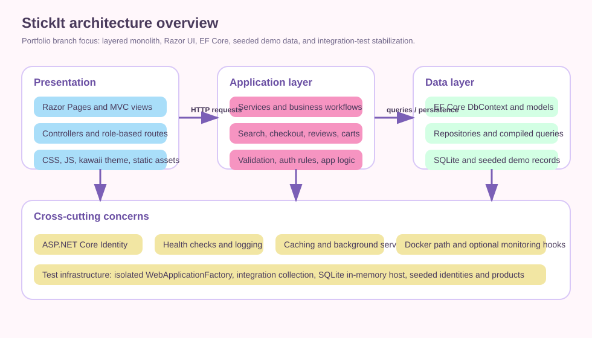

# StickIt

StickIt is a portfolio eCommerce app for selling custom stickers, built with ASP.NET Core on .NET 10.

It started as a group systems project under the internal name `ELKH`. This branch is the portfolio-facing version where I focused on hardening the app, tightening the architecture, improving the UI, documenting the tradeoffs, and stabilizing the test suite.

## What is this?

A full-stack web application with:
- storefront browsing and search
- cart and checkout flows
- authentication and role-based areas
- admin / manager / staff workflows
- seeded demo data for local exploration
- unit and integration tests

## What can it do?

### Customer-facing flows
- Browse a product catalog with search, filters, and product details
- Add items to cart and move through checkout flows
- Register, sign in, manage profile data, and view order history
- Leave ratings and reviews

### Back-office flows
- Admin, manager, and staff roles with separate workflows
- Product and inventory management paths
- Order and transaction views
- User and role management

### Engineering-focused features
- EF Core + SQLite local setup
- ASP.NET Core Identity for auth and roles
- Health checks and optional monitoring hooks
- Docker-based local run path
- Integration test host with isolated SQLite in-memory databases

## UI walkthrough and portfolio evidence

This repo still needs real product screenshots before it is presentation-ready. I have added a capture checklist so the README can point to the exact assets that should exist for a proper portfolio pass.

### Screenshots and demo assets to capture

| Surface | Planned asset | Why it matters |
|---|---|---|
| Homepage | `docs/assets/portfolio/homepage-desktop.png` | Shows the visual language and first-run experience |
| Product catalog | `docs/assets/portfolio/catalog-desktop.png` | Shows search, filtering, and intentional sample data |
| Cart | `docs/assets/portfolio/cart-desktop.png` | Shows cart summary and pricing flow |
| Checkout | `docs/assets/portfolio/checkout-desktop.png` | Shows form design and checkout UX |
| Admin dashboard | `docs/assets/portfolio/admin-dashboard-desktop.png` | Shows role-based back-office workflows |
| Staff order screen | `docs/assets/portfolio/staff-orders-desktop.png` | Shows operational workflow beyond the storefront |
| Demo GIF | `docs/assets/portfolio/storefront-flow.gif` | Short browse-to-cart or browse-to-checkout flow |
| Responsive views | `docs/assets/portfolio/homepage-mobile.png`, `docs/assets/portfolio/catalog-tablet.png` | Shows the app does not only work at desktop width |

Current visual assets already in the repo:

| Preview | Asset |
|---|---|
| Logo |  |
| Architecture |  |

Capture checklist: [docs/assets/portfolio/README.md](docs/assets/portfolio/README.md)

## What I personally built / improved

This branch is intended to show my portfolio contributions, especially around:
- refactoring and hardening the storefront architecture
- product catalog search and filter behavior
- checkout and guest-checkout stabilization
- role-based workflow cleanup
- integration-test reliability and shared-host isolation
- Docker and local-environment simplification
- documentation cleanup and portfolio positioning
- UI polish, accessibility-minded improvements, and design-system cleanup

The original team credits are preserved later in this README.

## Run it in 5 minutes

### Prerequisites
- .NET 10 SDK (`global.json` pins `10.0.300`)
- SQLite support via the normal .NET local workflow
- Optional: Docker Desktop for the container path

### Local app run

```bash
git clone https://github.com/Velyene/StickIt.git
cd StickIt
dotnet restore
dotnet ef database update --project ELKH
dotnet run --project ELKH
```

Then open:
- App: `https://localhost:5001` or `http://localhost:5000`
- Health check: `https://localhost:5001/health`

### Local Docker run

```bash
copy .env.example .env
docker compose up --build
```

Then open:
- App: `http://localhost:8080`
- Health check: `http://localhost:8080/health`

## Demo logins

The app can seed local demo accounts through `ELKH/Data/DbSeeder.Users.cs`, but default elevated credentials are now disabled unless development explicitly opts in with `Seed:AllowDefaultElevatedCredentials=true`.

| Role | Email | Password |
|---|---|---|
| Admin | `admin@stickit.dev` | `Admin@2025!` |
| Manager | `manager@stickit.dev` | `Manager@2025!` |
| Staff | `staff@stickit.dev` | `Staff@2025!` |

These defaults are for explicit local demo mode only. In non-development environments, configure elevated seed credentials explicitly or disable privileged seeding.

The customer seeder also generates many demo customer accounts with `@home.com` emails and `Demo@2025!##` style passwords for local and demo exploration.

## Sample data that looks intentional

The seeded catalog is not just placeholder rows. It includes themed sticker sets with names, prices, discounts, stock levels, and categories that are easy to demo in screenshots.

Examples from the seeded catalog:
- `Maple Leaf Pride Sticker`
- `Kawaii Panda Sticker`
- `Santa Claus Face Sticker`
- `Pizza Slice Sticker`
- `Toronto Skyline Sticker`
- `Quokka Smile Sticker`

That makes it possible to capture portfolio screenshots that look curated instead of fake or auto-generated.

## Technical decisions worth noticing

### 1. Razor-first app with layered organization
The workspace contains Razor Pages support, MVC controllers, services, repositories, and EF Core-backed models. The project is not trying to be a microservices system; it is a layered monolith designed to be understandable in one repo.

### 2. SQLite for the local happy path
I kept the supported local path simple. You can run the app with SQLite and the seeded data without provisioning a full external stack.

### 3. Test-host isolation for integration reliability
A major part of the portfolio hardening work was stabilizing the integration suite by isolating the shared host and aligning fragile tests with real runtime behavior.

### 4. Design-system separation
Customer-facing visual polish lives mainly in `kawaii-theme.css`, while `site.css` holds site-level utilities, accessibility helpers, and compatibility styling.

### 5. Optional infrastructure, not mandatory local complexity
Monitoring, deployment, and cloud-oriented docs exist, but the supported local path is intentionally much smaller than the full aspirational infrastructure story.

## Accessibility receipts

I do not want to leave accessibility at the level of “WCAG compliant” marketing copy, so here are concrete implementation examples already present in the codebase:

- Skip links in the shared layout for keyboard users (`ELKH/Views/Shared/_Layout.cshtml`)
- Search autocomplete wired as a listbox/combobox with keyboard navigation and ARIA state updates (`ELKH/wwwroot/js/site.js`)
- Live region and alert behavior in cart and checkout feedback (`ELKH/Views/Cart/Index.cshtml`, `ELKH/wwwroot/js/cart-ajax.js`)
- Form validation messaging using `role="alert"` and `aria-live="polite"` patterns across auth and checkout flows
- Reduced-motion and focus-visible styling support in the theme and site CSS

What is still missing for a stronger portfolio presentation:
- committed axe or Lighthouse screenshots/results
- a short keyboard-only walkthrough GIF
- mobile screenshots showing touch target sizing and responsive layout behavior

Accessibility notes and references: [docs/ACCESSIBILITY.md](docs/ACCESSIBILITY.md)

## Architecture at a glance


## Repo map

```text
ELKH/
├── Controllers/      MVC and API endpoints
├── Views/            Razor views and shared layouts
├── Areas/Identity/   Identity UI and account flows
├── Services/         Business logic
├── Repositories/     Data access abstractions
├── Data/             DbContext, migrations, seeders
├── Middleware/       HTTP pipeline behavior
├── Extensions/       Service/app startup extensions
└── wwwroot/          CSS, JS, images, static assets
```

## Testing

Run the full test project:

```bash
dotnet test ELKH.Tests/ELKH.Tests.csproj
```

Current validated integration state on this branch:
- full integration suite passing (`91/91`)
- targeted catalog + product API integration slice passing (`34/34`)

Latest verification commands used on this branch:

```bash
dotnet test "ELKH.Tests\ELKH.Tests.csproj" -p:Threshold=0 --filter "FullyQualifiedName~ELKH.Tests.Integration"
dotnet test "ELKH.Tests\ELKH.Tests.csproj" -p:Threshold=0 --filter "FullyQualifiedName~ProductCatalogIntegrationTests|FullyQualifiedName~ProductApiIntegrationTests"
```

There is also coverage and reporting infrastructure in the repo, but this README is focused on how to run and inspect the app quickly instead of presenting the project like a product brochure.

## Known limitations

This is a portfolio project, not a production deployment blueprint.

Intentionally not production-ready or not fully finished:
- real payment and external-service integrations should be treated as demo and development paths unless fully configured
- seeded demo credentials are suitable for local use only
- real UI screenshots, responsive captures, and a short demo GIF still need to be committed
- some docs describe optional or aspirational infrastructure beyond the supported local happy path
- local SQLite is the easiest supported run path, but not a claim of production-scale persistence strategy
- vendor and dev-tool browser warnings, for example CSS Hot Reload skips, may appear during local development and are not app defects
- no committed axe/Lighthouse audit artifacts are in the repo yet

## Roadmap / future improvements

- add the planned homepage/catalog/cart/checkout/admin/staff screenshots
- add a short storefront demo GIF and responsive screenshots
- add a small scripted demo-data reset flow for portfolio reviewers
- tighten README screenshots, demo narrative, and before and after architecture notes
- improve coverage on high-value business logic and critical UI flows
- continue trimming documentation that reads more enterprise platform than portfolio project
- document a cleaner production-readiness checklist separating current reality from future work
- add committed accessibility audit artifacts such as axe or Lighthouse captures

## Detailed docs

The `docs/` folder is intentionally larger than this README. Use the README for the quick portfolio tour, then go deeper as needed.

- [Docs index](docs/README.md)
- [Architecture guide](docs/ARCHITECTURE.md)
- [API guide](docs/API.md)
- [Deployment notes](docs/DEPLOYMENT.md)
- [Monitoring notes](docs/MONITORING.md)
- [User guide](docs/USER_GUIDE.md)
- [Test project readme](ELKH.Tests/README.md)

## My contributions vs. original team work

This repo began as a group systems project. I kept the team credits visible while using this branch to highlight my own follow-up work.

### Portfolio branch emphasis
- architecture cleanup
- integration-test stabilization
- local-run simplification
- documentation polish
- UI and accessibility refinement
- practical portfolio presentation

### Original team credits

`ELKH` is the original team acronym derived from the members' first names.

| Member | Commits | Primary Contributions |
|--------|---------|----------------------|
| **Evan Hao** ([@Evlazy](https://github.com/Evlazy)) | 21 | Inventory management system, database schema and EF Core migrations, product image upload and delete, order and transaction history for staff, product data models |
| **Lovedeep Kaur** ([@Love-082](https://github.com/Love-082)) | 24 | Admin role management, admin dashboard, sales analytics, manager product management, staff account views, manager transaction lists |
| **Kimberly Hilliker** ([@Velyene](https://github.com/Velyene)) | 159 | Core application architecture, product catalog with fuzzy search and filtering, shopping cart, checkout and PayPal sandbox integration, user profiles and address book, ratings and reviews, shared layouts, kawaii design system and WCAG accessibility work, Docker infrastructure, background services, monitoring |
| **Harry Yu** ([@yyu150](https://github.com/yyu150)) | 11 | Cart controller and cart views, checkout flow and order confirmation pages, guest checkout, order processing, home page |

## License

This project is licensed under the MIT License. See [LICENSE](LICENSE).