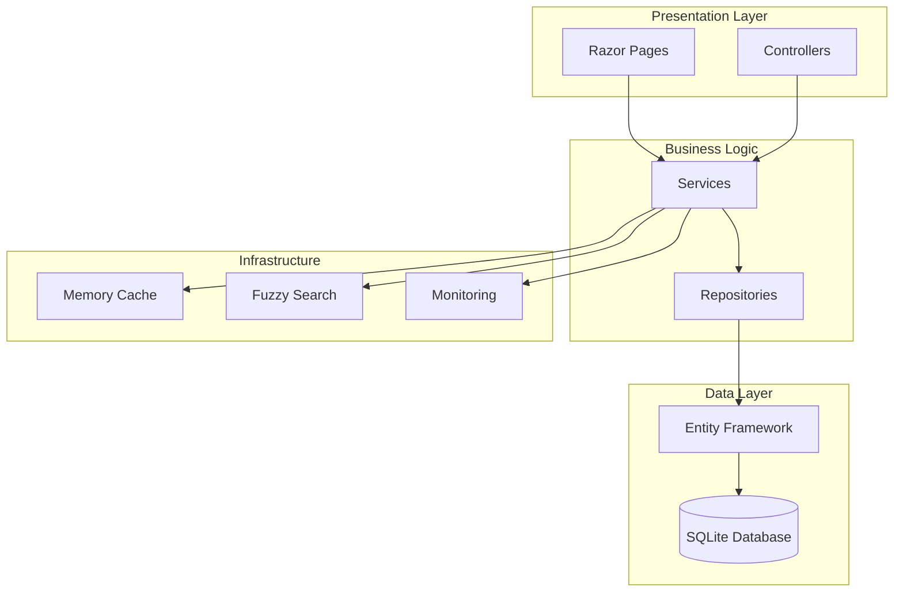

# 🏷️ ELKH - Premium Sticker eCommerce Platform

[](https://github.com/Velyene/StickIt/actions)
[](docs/ARCHITECTURE.md)
[](ELKH.Tests/README.md)
[](docs/DEPLOYMENT.md)

> A modern, scalable eCommerce platform built with ASP.NET Core 10 Razor Pages, featuring advanced search, comprehensive monitoring, and enterprise-grade architecture.

## ✨ Key Features

### 🛒 **Core eCommerce**
- **Product Catalog** - Advanced search with fuzzy matching and filtering
- **Shopping Cart** - Real-time cart management with session persistence  
- **Order Management** - Complete order lifecycle with status tracking
- **User Accounts** - Registration, profiles, address book, order history

### 🔐 **Security & Authentication**
- **ASP.NET Core Identity** - Secure user authentication and authorization
- **Role-based Access** - Admin, Manager, Staff, Customer roles
- **Security Middleware** - Rate limiting, CORS, and data protection

### ⚡ **Performance & Scalability**
- **Optimized Database** - SQLite with EF Core 10 and query optimization
- **Image Processing** - Automatic image optimization and compression
- **Caching Strategy** - Multi-level caching for enhanced performance
- **Background Services** - Async processing for heavy operations

### 📊 **Monitoring & Observability**
- **Application Insights** - Comprehensive telemetry and performance tracking
- **Prometheus Metrics** - Business and infrastructure monitoring
- **Health Checks** - Database and service health monitoring
- **Structured Logging** - Detailed application logging and error tracking

### 🎨 **Modern Architecture**
- **Clean Architecture** - Decomposed controllers and separation of concerns
- **SOLID Principles** - Maintainable and extensible codebase
- **Dependency Injection** - Comprehensive service registration
- **Docker Ready** - Containerized deployment with multi-stage builds

## 🏗️ Architecture Overview



### Controller Architecture
- **UserProfileController** - Dashboard, profile management, avatar upload
- **UserAddressController** - Address book CRUD operations
- **UserReviewController** - Product ratings and store testimonials
- **AdminUserController** - User management and role administration
- **AdminAnalyticsController** - Sales analytics and business intelligence
- **AdminSystemController** - System management and maintenance

## 🚀 Quick Start

### Prerequisites
- **[.NET 10 SDK](https://dotnet.microsoft.com/download)** - Latest LTS version
- **[Visual Studio 2026](https://visualstudio.microsoft.com/)** - Community, Professional, or Enterprise
- **[Docker Desktop](https://www.docker.com/products/docker-desktop)** - For containerized deployment
- **[Git](https://git-scm.com/)** - Version control

### Local Development Setup

1. **Clone the Repository**
   ```bash
   git clone https://github.com/Velyene/StickIt.git
   cd StickIt
   ```

2. **Restore Dependencies**
   ```bash
   dotnet restore
   ```

3. **Setup Database**
   ```bash
   # Apply migrations and seed test data
   dotnet ef database update --project ELKH
   ```

4. **Run the Application**
   ```bash
   dotnet run --project ELKH
   ```

5. **Access the Application**
   - **Main Site**: http://localhost:5000
   - **HTTPS**: https://localhost:5001
   - **Health Checks**: http://localhost:5000/health

### Docker Development

```bash
# Build and run with Docker Compose
docker-compose up -d

# View logs
docker-compose logs -f elkh-app

# Stop containers
docker-compose down
```

## 🧪 Testing

### Run All Tests
```bash
# Unit and integration tests with coverage
dotnet test --collect:"XPlat Code Coverage"

# Run specific test category
dotnet test --filter Category=Unit
```

### Generate Coverage Report
```bash
# Install ReportGenerator (one-time)
dotnet tool install -g dotnet-reportgenerator-globaltool

# Generate HTML coverage report
reportgenerator -reports:"./TestResults/**/coverage.cobertura.xml" -targetdir:"./CoverageReport" -reporttypes:Html
```

**Test Coverage Targets:**
- Line Coverage: 80%+
- Branch Coverage: 70%+
- Method Coverage: 85%+

## 📦 Deployment

### Production Deployment with Docker

```bash
# Build production image
docker build -f Dockerfile -t elkh-app:latest .

# Run production stack
docker-compose -f docker-compose.prod.yml up -d
```

### Azure Deployment

```bash
# Deploy to Azure using provided scripts
./Infrastructure/deploy.ps1 -Environment Production
```

See [Deployment Guide](docs/DEPLOYMENT.md) for detailed instructions.

## 📊 Monitoring

### Prometheus Metrics
- **Application Metrics**: http://localhost:9090
- **Custom Dashboards**: Business and performance metrics
- **Alerting Rules**: Critical system and business alerts

### Application Insights
- **Performance Tracking**: Request/response times and dependencies
- **Error Monitoring**: Exception tracking and debugging
- **Business Metrics**: User behavior and conversion tracking

## 🛠️ Development Workflow

### Code Organization
```
ELKH/
├── Controllers/           # Decomposed feature controllers
├── Services/             # Business logic services
├── Repositories/         # Data access layer
├── Models/              # Domain models and DTOs
├── Views/               # Razor views and layouts
├── Data/                # DbContext and migrations
├── Telemetry/           # Application Insights processors
├── Middleware/          # Custom middleware components
└── Extensions/          # Service and app extensions
```

### Branching Strategy
- **main** - Production-ready code
- **develop** - Integration branch
- **feature/** - Feature branches
- **hotfix/** - Production fixes

### Code Standards
- **C# 14** features and nullable reference types
- **Clean Code** principles and SOLID design
- **XML Documentation** for public APIs
- **Unit Tests** for all business logic

## 🔧 Configuration

### Environment Variables
```bash
ASPNETCORE_ENVIRONMENT=Development
ConnectionStrings__DefaultConnection="Data Source=elkh.db"
ApplicationInsights__InstrumentationKey="your-key"
```

### User Secrets (Development)
```bash
dotnet user-secrets set "SmtpSettings:Password" "your-password"
dotnet user-secrets set "ApplicationInsights:InstrumentationKey" "your-key"
```

## 📚 Documentation

- **[Architecture Guide](docs/ARCHITECTURE.md)** - System design and patterns
- **[API Documentation](docs/API.md)** - Endpoint reference and examples
- **[Deployment Guide](docs/DEPLOYMENT.md)** - Docker and Azure deployment
- **[Monitoring Guide](docs/MONITORING.md)** - Application Insights, Prometheus, and maintenance
- **[User Guide](docs/USER_GUIDE.md)** - Customer, staff, and admin user documentation
- **[Contributing Guidelines](docs/CONTRIBUTING.md)** - Development workflow and standards
- **[Testing Guide](ELKH.Tests/README.md)** - Test coverage and execution

## 🤝 Contributing

1. **Fork the Repository**
2. **Create Feature Branch** - `git checkout -b feature/amazing-feature`
3. **Write Tests** - Maintain 80%+ coverage
4. **Commit Changes** - Use conventional commits
5. **Push Branch** - `git push origin feature/amazing-feature`
6. **Create Pull Request** - Include tests and documentation

See [Contributing Guidelines](docs/CONTRIBUTING.md) for detailed information.

## 👥 Team

**ELKH** is an acronym of the team members' first names. Built for the Systems Project course.

| Member | Commits | Primary Contributions |
|--------|---------|----------------------|
| **Evan Hao** ([@Evlazy](https://github.com/Evlazy)) | 21 | Inventory management system, database schema and EF Core migrations, product image upload and delete, order and transaction history for staff, product data models |
| **Lovedeep Kaur**([@Love-082] https://github.com/Love-082))| 24 | Admin role management (create, edit, delete, assign roles), admin dashboard, sales analytics, manager product management (list, add, edit, soft-delete/restore), staff accounts view, manager transactions list |
| **Kimberly Hilliker** ([@Velyene](https://github.com/Velyene)) | 159 | Core application architecture, product catalog with fuzzy search and filtering, shopping cart, checkout and PayPal sandbox integration, user profiles and address book, ratings and reviews, shared layouts, kawaii design system and WCAG accessibility compliance, Docker infrastructure, background services, monitoring |
| **Harry Yu** ([@yyu150](https://github.com/yyu150)) | 11 | Cart controller and cart views, checkout flow and order confirmation pages, guest checkout, order processing, home page |

## 📄 License

This project is licensed under the MIT License - see the [LICENSE](LICENSE) file for details.

## 🆘 Support

- **Documentation**: [docs/](docs/)
- **Issues**: [GitHub Issues](https://github.com/Velyene/StickIt/issues)
- **Health Checks**: http://localhost:5000/health

## 🏆 Project Highlights

- ✅ **Enterprise Architecture** - Clean, maintainable, and scalable design
- ✅ **80%+ Test Coverage** - Comprehensive unit and integration tests
- ✅ **Production Ready** - Docker deployment and monitoring
- ✅ **Modern Stack** - .NET 10, Entity Framework Core, Application Insights
- ✅ **Performance Optimized** - Caching, image optimization, database tuning
- ✅ **Security Focused** - Authentication, authorization, and data protection

---

<div align="center">

**[⭐ Star this repository](https://github.com/Velyene/StickIt)** if you find it helpful!

*Built with ❤️ using ASP.NET Core*

</div>
