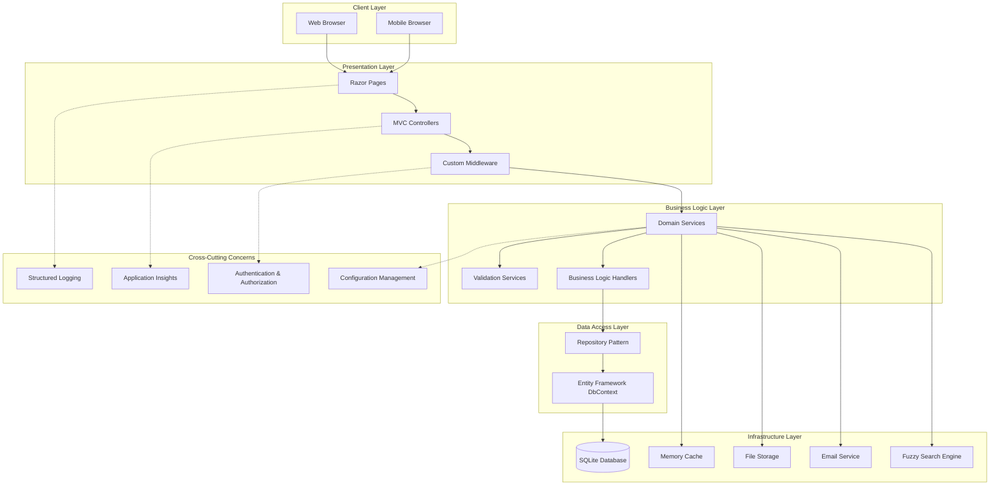
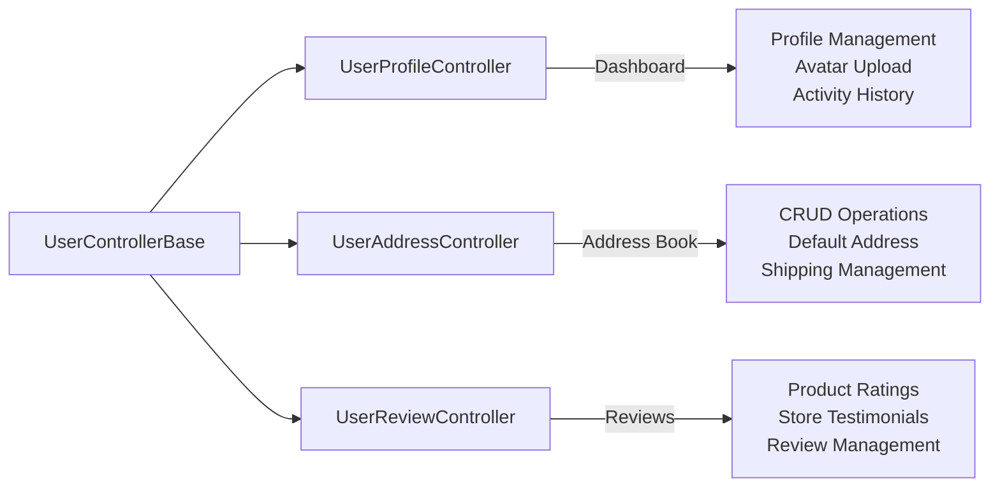
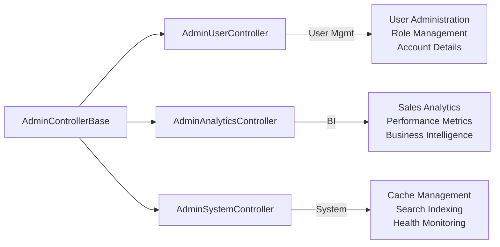
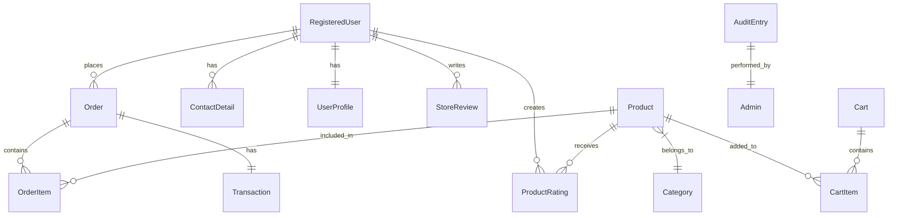
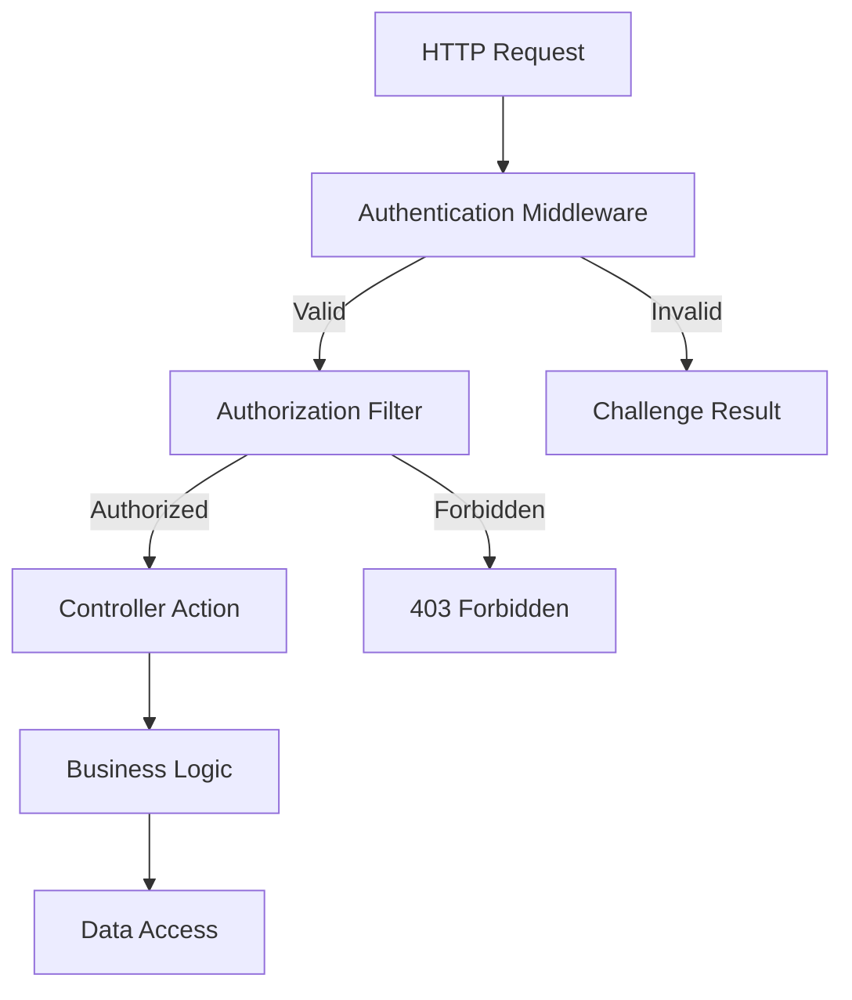
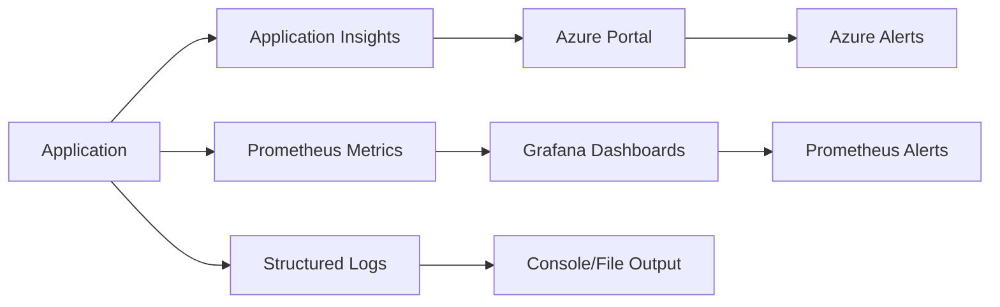
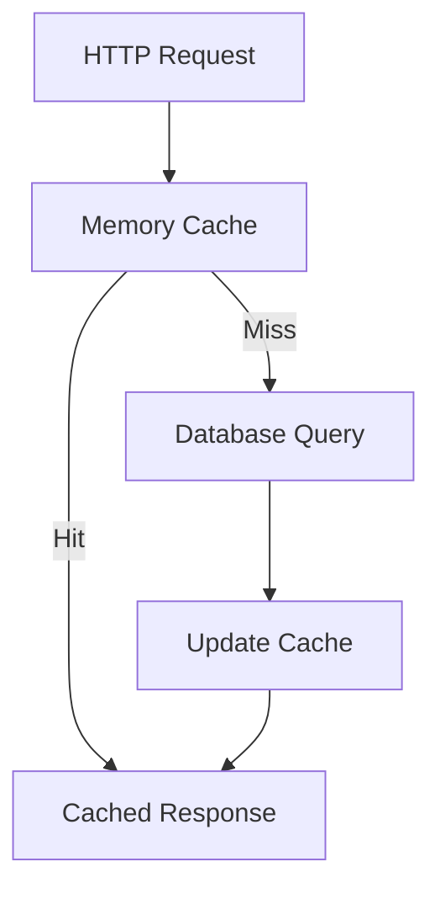
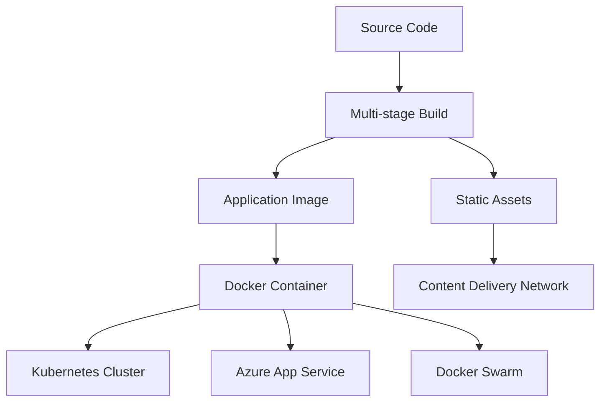
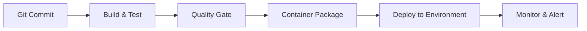

# 🏗️ StickIt Architecture Guide

## Overview

StickIt follows **Clean Architecture** principles with clear separation of concerns, ensuring maintainability, testability, and scalability. The architecture is designed to support both current e-commerce requirements and future growth.

## 🎯 Architecture Principles

### Core Design Principles
- **Separation of Concerns** - Each layer has distinct responsibilities
- **Dependency Inversion** - High-level modules don't depend on low-level modules
- **Single Responsibility** - Classes and methods have one clear purpose
- **Open/Closed Principle** - Open for extension, closed for modification
- **Interface Segregation** - Clients depend only on interfaces they use

### Quality Attributes
- **Maintainability** - Clean code structure and comprehensive documentation
- **Scalability** - Async patterns and performance optimization
- **Testability** - Dependency injection and interface-based design
- **Security** - Multi-layered security and authentication
- **Observability** - Comprehensive logging and monitoring

## 🏛️ System Architecture



## 📦 Project Structure

### High-Level Organization
```
StickIt/
├── ELKH/                           # Main web application
│   ├── Controllers/                # HTTP controllers (decomposed)
│   ├── Data/                      # Database context and migrations
│   ├── Extensions/                # Service and app configuration extensions
│   ├── Middleware/               # Custom middleware components
│   ├── Models/                   # Domain models and DTOs
│   ├── Pages/                    # Razor pages and view models
│   ├── Repositories/            # Data access layer
│   ├── Services/               # Business logic services
│   ├── Telemetry/             # Application Insights processors
│   ├── Views/                 # MVC views and layouts
│   └── wwwroot/              # Static web assets
├── ELKH.Tests/               # Comprehensive test suite
├── Infrastructure/          # Deployment and infrastructure
├── monitoring/             # Prometheus and monitoring config
└── docs/                  # Documentation
```

## 🎮 Controller Decomposition

### Original Monolithic Design
- **UserController** (772 lines) - Multiple responsibilities
- **AdminController** (644 lines) - Mixed concerns

### Decomposed Architecture

#### User Area Controllers


#### Admin Area Controllers


### Benefits of Decomposition
- **📏 Smaller Files** - Each controller averages 250-350 lines
- **🎯 Single Responsibility** - Each controller has one domain focus
- **🧪 Better Testability** - Isolated functionality is easier to test
- **👥 Team Collaboration** - Different teams can work on different areas
- **🔄 Easier Maintenance** - Changes are contained to specific areas

## 🗃️ Data Layer Architecture

### Database Design


### Entity Relationships
- **One-to-One**: User ↔ Profile, Order ↔ Transaction
- **One-to-Many**: User → Orders, Product → Ratings, Category → Products
- **Many-to-Many**: Implemented via junction tables

### Repository Pattern Implementation
```csharp
// Generic repository interface
public interface IRepository<T> where T : class
{
    Task<T?> GetByIdAsync(int id);
    Task<IEnumerable<T>> GetAllAsync();
    Task<T> AddAndSaveAsync(T entity);
    Task<bool> UpdateAndSaveAsync(T entity);
    Task<bool> DeleteAsync(int id);
}

// Specific repository with business logic
public interface IRegisteredUserLogRepo : IRepository<RegisteredUserLogModel>
{
    Task LogActivityAsync(string email, string activityType, string details);
    Task<IEnumerable<RegisteredUserLogModel>> GetRecentActivityAsync(string email, int count);
}
```

## 🔧 Service Layer Architecture

### Service Organization
```
Services/
├── IUserService.cs              # User management and authentication
├── ISearchService.cs           # Product search and filtering
├── IImageOptimizationService.cs # Image processing and optimization
├── IEmailService.cs            # Email notifications
├── IRatingService.cs           # Product ratings and reviews
├── IStoreReviewService.cs      # Store testimonials
├── IOrderService.cs            # Order management
├── IPaymentService.cs          # Payment processing
└── IFuzzyReindexService.cs     # Background search indexing
```

### Service Patterns

#### Async/Await Pattern
```csharp
public class UserService : IUserService
{
    public async Task<UserDashboardVM> GetDashboardDataAsync(int userId)
    {
        // Parallel data fetching for performance
        var wishlistTask = GetWishlistAsync(userId);
        var ordersTask = GetRecentOrdersAsync(userId);
        var reviewsTask = GetRecentReviewsAsync(userId);
        
        await Task.WhenAll(wishlistTask, ordersTask, reviewsTask);
        
        return new UserDashboardVM
        {
            Wishlist = await wishlistTask,
            RecentOrders = await ordersTask,
            RecentReviews = await reviewsTask
        };
    }
}
```

#### Dependency Injection Configuration
```csharp
// Service registration in Program.cs
services.AddScoped<IUserService, UserService>();
services.AddScoped<ISearchService, SearchService>();
services.AddSingleton<IImageOptimizationService, ImageOptimizationService>();
services.AddScoped<IEmailService, EmailService>();
```

## 🛡️ Security Architecture

### Authentication & Authorization


### Role-Based Security
- **Customer** - Basic user operations
- **Staff** - Order management and customer support
- **Manager** - Advanced reporting and user management
- **Admin** - Full system access and configuration

### Security Middleware Stack
```csharp
// Security middleware pipeline
app.UseHttpsRedirection();
app.UseHsts();
app.UseAuthentication();
app.UseAuthorization();
app.UseRateLimiter();
app.UseSecurityHeaders();
```

## 📊 Monitoring & Observability

### Telemetry Architecture


### Custom Telemetry Processors
- **PerformanceEnrichmentProcessor** - Adds business context and performance tiers
- **SensitiveDataFilterProcessor** - Removes PII from telemetry
- **GlobalExceptionMiddleware** - Centralized error handling and reporting

### Monitoring Metrics
- **Application Metrics**: Request rates, response times, error rates
- **Business Metrics**: Orders per minute, cart abandonment, revenue
- **Infrastructure Metrics**: CPU, memory, disk usage
- **Custom Events**: User actions, business workflows, system events

## ⚡ Performance Architecture

### Caching Strategy


### Performance Optimizations
- **Database Indexing** - Strategic indexes on frequently queried columns
- **Image Optimization** - Automatic compression and format conversion
- **Async Operations** - Non-blocking I/O for all external calls
- **Connection Pooling** - Efficient database connection management
- **Static File Compression** - Gzipped CSS, JS, and image assets

### Background Services
```csharp
// Background service for search indexing
public class FuzzyReindexService : BackgroundService
{
    protected override async Task ExecuteAsync(CancellationToken stoppingToken)
    {
        while (!stoppingToken.IsCancellationRequested)
        {
            await ReindexProductsAsync();
            await Task.Delay(TimeSpan.FromHours(1), stoppingToken);
        }
    }
}
```

## 🧪 Testing Architecture

### Test Pyramid
```mermaid
pyramid
    title Test Pyramid
    percentile
    "Unit Tests|80%"
    "Integration Tests|15%"
    "E2E Tests|5%"
```

### Test Organization
- **Unit Tests** - Service logic, repository methods, utility functions
- **Integration Tests** - Database operations, external service calls
- **Controller Tests** - HTTP endpoints, authentication, authorization
- **End-to-End Tests** - Complete user workflows and business processes

### Testing Tools
- **xUnit** - Primary testing framework
- **Moq** - Mocking framework for dependencies
- **TestContainers** - Integration testing with real databases
- **Coverlet** - Code coverage analysis
- **ReportGenerator** - Coverage reporting

## 🚀 Deployment Architecture

### Containerization


### Environment Strategy
- **Development** - Local development with SQLite
- **Staging** - Azure App Service with SQL Database
- **Production** - Kubernetes cluster with high availability

### CI/CD Pipeline


## 📈 Scalability Considerations

### Horizontal Scaling
- **Stateless Design** - No server-side state storage
- **Database Connection Pooling** - Efficient resource utilization
- **CDN Integration** - Static asset distribution
- **Load Balancer Ready** - Multiple instance support

### Performance Bottlenecks
1. **Database Queries** - Mitigated by indexing and caching
2. **Image Processing** - Async processing with background services
3. **Search Operations** - Optimized with fuzzy search indexing
4. **Email Sending** - Queue-based processing for bulk operations

## 🔮 Future Enhancements

### Planned Improvements
- **Microservices Migration** - Domain-driven service boundaries
- **Event Sourcing** - Audit trail and state reconstruction
- **CQRS Implementation** - Command/Query responsibility segregation
- **GraphQL API** - Flexible client-driven data fetching
- **Real-time Features** - SignalR for live updates

### Technology Roadmap
- **Database Migration** - PostgreSQL for production scaling
- **Message Queues** - RabbitMQ/Azure Service Bus for async processing
- **API Gateway** - Centralized routing and cross-cutting concerns
- **Container Orchestration** - Kubernetes for production deployment

---

## 📚 Related Documentation

- **[API Documentation](API.md)** - Endpoint reference and examples
- **[Deployment Guide](DEPLOYMENT.md)** - Docker and Azure deployment
- **[Contributing Guidelines](CONTRIBUTING.md)** - Development workflow
- **[Testing Guide](../ELKH.Tests/README.md)** - Test execution and coverage

---

*This architecture supports the current e-commerce requirements while providing a foundation for future growth and scalability.*