# 🤝 Contributing to ELKH

Thank you for your interest in contributing to ELKH! This guide will help you get started with development, testing, and submitting contributions.

## 🚀 Getting Started

### Prerequisites
- **[.NET 10 SDK](https://dotnet.microsoft.com/download)** (Latest LTS)
- **[Visual Studio 2026](https://visualstudio.microsoft.com/)** (Community/Professional/Enterprise)
- **[Git](https://git-scm.com/)** (Latest stable version)
- **[Docker Desktop](https://www.docker.com/products/docker-desktop)** (Optional, for containerized development)

### Development Environment Setup

1. **Fork and Clone Repository**
   ```bash
   git clone https://github.com/YOUR_USERNAME/StickIt.git
   cd StickIt
   git remote add upstream https://github.com/Velyene/StickIt.git
   ```

2. **Install Dependencies**
   ```bash
   dotnet restore
   ```

3. **Setup Database**
   ```bash
   dotnet ef database update --project ELKH
   ```

4. **Configure User Secrets**
   ```bash
   dotnet user-secrets set "SmtpSettings:Password" "your-dev-password" --project ELKH
   dotnet user-secrets set "ApplicationInsights:InstrumentationKey" "your-dev-key" --project ELKH
   ```

5. **Run Application**
   ```bash
   dotnet run --project ELKH
   ```

## 🏗️ Project Structure

### Understanding the Architecture
```
ELKH/
├── Controllers/Base/          # Shared controller base classes
├── Controllers/              # Feature-specific controllers
│   ├── UserProfileController.cs
│   ├── UserAddressController.cs
│   ├── UserReviewController.cs
│   ├── AdminUserController.cs
│   ├── AdminAnalyticsController.cs
│   └── AdminSystemController.cs
├── Data/                    # DbContext and migrations
├── Extensions/              # Service registration and app configuration
├── Middleware/             # Custom middleware components
├── Models/                 # Domain models and entities
├── Repositories/           # Data access layer
├── Services/              # Business logic services
├── Telemetry/            # Application Insights processors
└── Views/                # Razor views and layouts
```

## 📝 Coding Standards

### C# Conventions
- **Language Version**: C# 14 with .NET 10 features
- **Nullable Reference Types**: Always enabled
- **Naming Conventions**: Follow [Microsoft C# Guidelines](https://docs.microsoft.com/en-us/dotnet/csharp/fundamentals/coding-style/coding-conventions)

### Code Style Rules
```csharp
// ✅ Good - Async method with proper naming
public async Task<UserDashboardVM> GetDashboardDataAsync(int userId)
{
    var user = await _repository.GetByIdAsync(userId);
    return new UserDashboardVM
    {
        Profile = user.Profile,
        WishlistCount = user.Wishlists.Count
    };
}

// ❌ Bad - Sync method for async operation
public UserDashboardVM GetDashboardData(int userId)
{
    var user = _repository.GetById(userId); // Blocking call
    return new UserDashboardVM { /* ... */ };
}
```

### Documentation Standards
- **XML Documentation** required for all public APIs
- **Inline comments** for complex business logic
- **README updates** for new features

```csharp
/// <summary>
/// Retrieves user dashboard data including profile and activity summaries.
/// </summary>
/// <param name="userId">The unique identifier for the user.</param>
/// <returns>A task that represents the asynchronous operation, containing the dashboard view model.</returns>
/// <exception cref="ArgumentException">Thrown when userId is invalid.</exception>
public async Task<UserDashboardVM> GetDashboardDataAsync(int userId)
{
    // Implementation
}
```

## 🌿 Branching Strategy

### Branch Types
- **`main`** - Production-ready code, always deployable
- **`develop`** - Integration branch for features
- **`feature/{feature-name}`** - Individual features
- **`bugfix/{bug-description}`** - Bug fixes
- **`hotfix/{critical-issue}`** - Critical production fixes

### Branch Naming Conventions
```bash
# Features
feature/user-profile-enhancement
feature/payment-integration
feature/search-optimization

# Bug fixes
bugfix/cart-quantity-validation
bugfix/email-template-rendering

# Hot fixes
hotfix/security-vulnerability
hotfix/payment-gateway-timeout
```

### Workflow Process

```mermaid
graph LR
    A[Create Feature Branch] --> B[Implement Changes]
    B --> C[Write Tests]
    C --> D[Update Documentation]
    D --> E[Create Pull Request]
    E --> F[Code Review]
    F --> G[Merge to Develop]
    G --> H[Deploy to Staging]
    H --> I[Merge to Main]
    I --> J[Deploy to Production]
```


## 🧪 Testing Guidelines

### Test Categories
- **Unit Tests** (80% of test suite)
- **Integration Tests** (15% of test suite)  
- **End-to-End Tests** (5% of test suite)

### Writing Tests
```csharp
[Fact]
public async Task GetDashboardDataAsync_WithValidUserId_ReturnsCorrectData()
{
    // Arrange
    var userId = 1;
    var expectedUser = new RegisteredUserModel { /* ... */ };
    _mockRepository.Setup(r => r.GetByIdAsync(userId))
               .ReturnsAsync(expectedUser);

    // Act
    var result = await _userService.GetDashboardDataAsync(userId);

    // Assert
    Assert.NotNull(result);
    Assert.Equal(expectedUser.Profile.FirstName, result.Profile.FirstName);
    _mockRepository.Verify(r => r.GetByIdAsync(userId), Times.Once);
}
```

### Test Coverage Requirements
- **Minimum Line Coverage**: 80%
- **Minimum Branch Coverage**: 70%
- **All Public Methods**: Must have tests
- **Business Logic**: 100% coverage required

### Running Tests
```bash
# Run all tests with coverage
dotnet test --collect:"XPlat Code Coverage"

# Run specific test category
dotnet test --filter Category=Unit

# Run tests with live output
dotnet test --logger console --verbosity normal

# Generate coverage report
reportgenerator -reports:"./TestResults/**/coverage.cobertura.xml" -targetdir:"./CoverageReport" -reporttypes:Html
```

## 📋 Pull Request Process

### Before Creating PR
- [ ] Tests pass locally (`dotnet test`)
- [ ] Code builds without warnings (`dotnet build`)
- [ ] Coverage meets requirements (80%+)
- [ ] Documentation updated
- [ ] Security review completed

### PR Template
```markdown
## Description
Brief description of changes and motivation.

## Type of Change
- [ ] Bug fix (non-breaking change)
- [ ] New feature (non-breaking change)  
- [ ] Breaking change (fix or feature that would cause existing functionality to change)
- [ ] Documentation update

## Testing
- [ ] Unit tests added/updated
- [ ] Integration tests added/updated
- [ ] Manual testing completed
- [ ] Coverage maintained/improved

## Checklist
- [ ] Code follows style guidelines
- [ ] Self-review completed
- [ ] Documentation updated
- [ ] Tests added and passing
- [ ] No breaking changes (or properly documented)
```

### Code Review Guidelines

#### For Reviewers
- **Functionality** - Does it work as intended?
- **Performance** - Are there any performance implications?
- **Security** - Are there security vulnerabilities?
- **Maintainability** - Is the code readable and maintainable?
- **Testing** - Is it adequately tested?

#### Review Checklist
```markdown
- [ ] Code follows established patterns
- [ ] Proper error handling implemented
- [ ] Security considerations addressed
- [ ] Performance impact acceptable
- [ ] Tests cover new functionality
- [ ] Documentation updated
- [ ] Breaking changes documented
```

## 🔒 Security Guidelines

### Authentication & Authorization
- **Never commit credentials** to version control
- **Use User Secrets** for development credentials
- **Validate all inputs** server-side
- **Implement proper authorization** checks

### Secure Coding Practices
```csharp
// ✅ Good - Proper authorization check
[Authorize(Roles = "Admin")]
public async Task<IActionResult> DeleteUser(string userId)
{
    var currentUser = await GetCurrentUserAsync();
    if (currentUser?.IsAdmin != true)
    {
        return Forbid();
    }
    
    // Implementation
}

// ❌ Bad - Missing authorization
public async Task<IActionResult> DeleteUser(string userId)
{
    // Direct implementation without checks
}
```

### Data Protection
- **Encrypt sensitive data** at rest
- **Use HTTPS** for all communications
- **Implement rate limiting** on sensitive endpoints
- **Audit sensitive operations**

## 🚀 Performance Guidelines

### Database Performance
- **Use async methods** for all database operations
- **Implement proper indexing** strategy
- **Use pagination** for large data sets
- **Avoid N+1 queries** with proper includes

```csharp
// ✅ Good - Async with include
public async Task<IEnumerable<OrderModel>> GetUserOrdersAsync(int userId)
{
    return await _context.Orders
        .Include(o => o.OrderItems)
        .ThenInclude(oi => oi.Product)
        .Where(o => o.FkRegisteredUserId == userId)
        .ToListAsync();
}

// ❌ Bad - Sync operation
public List<OrderModel> GetUserOrders(int userId)
{
    return _context.Orders
        .Where(o => o.FkRegisteredUserId == userId)
        .ToList(); // Blocking call
}
```

### Caching Strategy
- **Cache expensive operations** with appropriate TTL
- **Use memory cache** for frequently accessed data
- **Implement cache invalidation** strategies

### Background Processing
- **Use background services** for heavy operations
- **Implement proper cancellation** support
- **Monitor resource usage**

## 🐛 Issue Reporting

### Bug Reports
Include the following information:
- **Environment** (Development/Staging/Production)
- **Steps to reproduce**
- **Expected behavior**
- **Actual behavior**
- **Screenshots** (if applicable)
- **Browser/OS information**

### Feature Requests
Include the following information:
- **Use case description**
- **Proposed solution**
- **Alternative solutions considered**
- **Additional context**

### Issue Labels
- `bug` - Something isn't working
- `enhancement` - New feature or request
- `documentation` - Improvements to documentation
- `help-wanted` - Good for newcomers
- `question` - Further information is requested

## 📦 Release Process

### Version Numbering
We use [Semantic Versioning](https://semver.org/):
- **MAJOR** - Incompatible API changes
- **MINOR** - New functionality in backward-compatible manner
- **PATCH** - Backward-compatible bug fixes

### Release Checklist
- [ ] All tests passing
- [ ] Documentation updated
- [ ] Migration scripts tested
- [ ] Performance impact assessed
- [ ] Security review completed
- [ ] Rollback plan prepared

## 💡 Best Practices

### Controller Design
- **Keep controllers thin** - Delegate to services
- **Single responsibility** - One domain per controller
- **Proper HTTP status codes** - Use semantic responses
- **Input validation** - Validate all inputs

### Service Layer
- **Interface-based design** - Use dependency injection
- **Async operations** - For all I/O operations
- **Error handling** - Comprehensive exception handling
- **Business logic separation** - Keep it in services

### Repository Pattern
- **Generic repositories** - With specific extensions
- **Unit of work** - For transaction management
- **Async methods** - For all database operations

### Logging
- **Structured logging** - Use proper log levels
- **Contextual information** - Include relevant data
- **Performance logging** - Track slow operations

```csharp
// ✅ Good - Structured logging
_logger.LogInformation("User {UserId} updated profile with {Changes}", 
    userId, new { firstName, lastName });

// ❌ Bad - String concatenation
_logger.LogInformation("User " + userId + " updated profile");
```

## 🆘 Getting Help

### Documentation
- **[Architecture Guide](ARCHITECTURE.md)** - System design overview
- **[API Documentation](API.md)** - Endpoint reference
- **[Deployment Guide](DEPLOYMENT.md)** - Docker and Azure deployment

### Community
- **GitHub Discussions** - For general questions
- **GitHub Issues** - For bug reports and feature requests
- **Code Reviews** - For implementation guidance

### Development Tools
- **Visual Studio IntelliCode** - AI-assisted development
- **Resharper** - Code quality analysis
- **SonarLint** - Code quality and security

## 🏆 Recognition

### Contribution Types
All contributions are valued:
- **Code contributions** - New features and bug fixes
- **Documentation** - Guides, API docs, examples
- **Testing** - Test coverage improvements
- **Bug reports** - Quality issue identification
- **Feature ideas** - Enhancement suggestions

### Contributor Guidelines
- Be respectful and constructive
- Follow the code of conduct
- Help others learn and grow
- Share knowledge and best practices

---

## 📜 Code of Conduct

We are committed to providing a welcoming and inclusive experience for everyone. Please read our full [Code of Conduct](CODE_OF_CONDUCT.md) before contributing.

Thank you for contributing to ELKH! 🚀