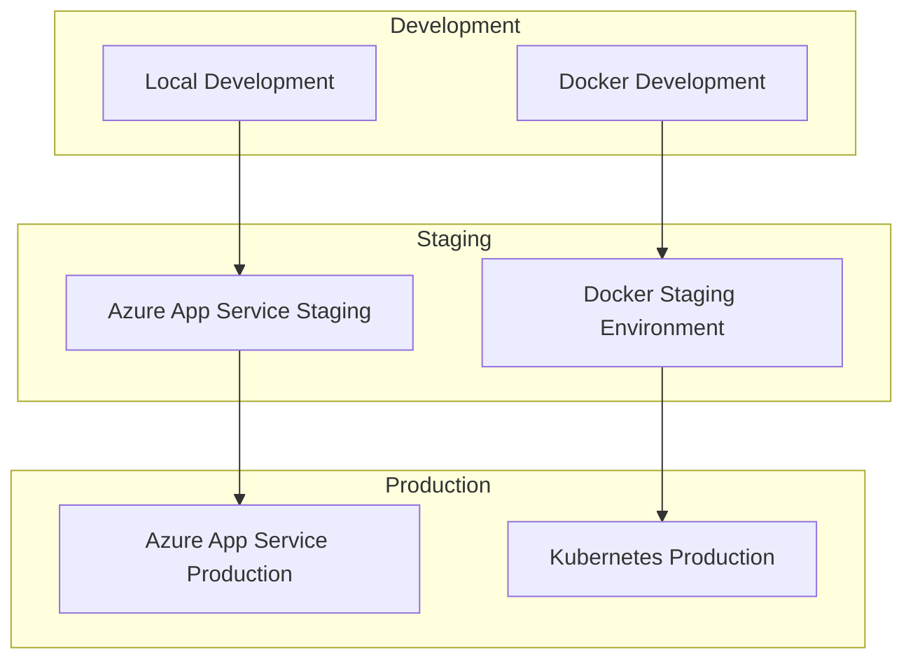

# 🚀 StickIt Deployment Guide

This guide covers deployment options for StickIt, from local development to production deployment on Azure with Docker containerization. The repository still uses `ELKH` as the internal project folder and assembly name.

## 📋 Deployment Overview

### Available Deployment Options
- **🏠 Local Development** - Direct dotnet run with SQLite
- **🐳 Docker Development** - Containerized local environment
- **☁️ Azure App Service** - PaaS deployment with Azure SQL
- **🏗️ Azure Container Instances** - Containerized cloud deployment
- **⚙️ Kubernetes** - Orchestrated container deployment

### Architecture Deployment Strategy


## 🏠 Local Development Deployment

### Prerequisites
- .NET 10 SDK
- Visual Studio 2026 or VS Code
- SQLite (included with EF Core)

### Quick Start
```bash
# Clone repository
git clone https://github.com/Velyene/StickIt.git
cd StickIt

# Restore packages
dotnet restore

# Apply database migrations
dotnet ef database update --project ELKH --context ApplicationDbContext
dotnet ef database update --project ELKH --context ImageStoreContext

# Run application
dotnet run --project ELKH
```

### Database evolution policy
- Treat Entity Framework Core migrations as the only supported schema evolution path for relational deployments.
- `Program.cs` applies `MigrateAsync()` for relational providers at startup and uses `EnsureCreatedAsync()` only for non-relational test providers.
- When `ApplicationDbContext` changes, create a follow-up migration instead of adding ad hoc startup SQL or schema patches:

```bash
dotnet ef migrations add <MigrationName> --project ELKH --context ApplicationDbContext --output-dir Data/Migrations
dotnet ef database update --project ELKH --context ApplicationDbContext
```

- When `ImageStoreContext` changes, add a follow-up migration for that context as well:

```bash
dotnet ef migrations add <MigrationName> --project ELKH --context ImageStoreContext --output-dir Models/Migrations/ImageStore
dotnet ef database update --project ELKH --context ImageStoreContext
```

- Do not patch schema drift with raw startup SQL for relational environments; commit a new migration and let deployment apply it.

### Development Configuration
```json
// appsettings.Development.json
{
  "ConnectionStrings": {
    "DefaultConnection": "Data Source=elkh-dev.db"
  },
  "Logging": {
    "LogLevel": {
      "Default": "Information",
      "Microsoft.AspNetCore": "Warning",
      "ELKH": "Debug"
    }
  },
  "ApplicationInsights": {
    "InstrumentationKey": ""
  }
}
```

### User Secrets Setup
```bash
# Configure sensitive settings
dotnet user-secrets set "SmtpSettings:Password" "dev-password" --project ELKH
dotnet user-secrets set "ApplicationInsights:InstrumentationKey" "dev-key" --project ELKH
```

## 🐳 Docker Deployment

### Development with Docker

#### Single Container
```bash
# Build development image
docker build -f Dockerfile -t stickit-web:dev --target development .

# Run with development database
docker run -p 5000:8080 -p 5001:8081 \
  -e ASPNETCORE_ENVIRONMENT=Development \
  -v $(pwd)/Data:/app/Data \
  stickit-web:dev
```

#### Docker Compose Development
```yaml
# docker-compose.yml
version: '3.8'
services:
  stickit-web:
    build:
      context: .
      dockerfile: Dockerfile
      target: development
    ports:
      - "5000:8080"
      - "5001:8081"
    environment:
      - ASPNETCORE_ENVIRONMENT=Development
      - ConnectionStrings__DefaultConnection=Data Source=/data/elkh.db
    volumes:
      - ./Data:/data
      - ./ELKH:/app
    develop:
      watch:
        - action: sync
          path: ./ELKH
          target: /app
        - action: rebuild
          path: ./ELKH/ELKH.csproj
```

### Production Docker Deployment

#### Multi-stage Dockerfile
```dockerfile
# Dockerfile (optimized)
# Build stage
FROM mcr.microsoft.com/dotnet/sdk:10.0 AS build
WORKDIR /src

# Copy project files
COPY ["ELKH/ELKH.csproj", "ELKH/"]
COPY ["ELKH.Tests/ELKH.Tests.csproj", "ELKH.Tests/"]

# Restore packages
RUN dotnet restore "ELKH/ELKH.csproj"

# Copy source code
COPY . .

# Build application
WORKDIR "/src/ELKH"
RUN dotnet build "ELKH.csproj" -c Release -o /app/build

# Test stage
FROM build AS test
WORKDIR /src
RUN dotnet test --configuration Release --collect:"XPlat Code Coverage"

# Publish stage  
FROM build AS publish
RUN dotnet publish "ELKH.csproj" -c Release -o /app/publish /p:UseAppHost=false

# Runtime stage
FROM mcr.microsoft.com/dotnet/aspnet:10.0 AS runtime
WORKDIR /app

# Create non-root user
RUN addgroup --group elkh --gid 1001 && \
    adduser --uid 1001 --gid 1001 --disabled-password elkh

# Copy published application
COPY --from=publish /app/publish .

# Set ownership
RUN chown -R elkh:elkh /app
USER elkh

# Configure ports
EXPOSE 8080 8081

# Health check
HEALTHCHECK --interval=30s --timeout=3s --start-period=5s --retries=3 \
  CMD curl -f http://localhost:8080/health || exit 1

# Set entry point
ENTRYPOINT ["dotnet", "ELKH.dll"]
```

#### Experimental Docker Compose Override

The current app startup is still wired for SQLite in `ELKH/Program.cs`. Treat `docker-compose.prod.yml` as an experimental override for future infrastructure work, not as a validated production deployment recipe.

```yaml
# docker-compose.prod.yml
version: '3.8'
services:
  elkh-app:
    build:
      context: .
      dockerfile: Dockerfile
      target: runtime
    ports:
      - "80:8080"
      - "443:8081"
    environment:
      - ASPNETCORE_ENVIRONMENT=Production
      - ConnectionStrings__DefaultConnection=${SQLITE_CONNECTION_STRING}
      - APPLICATIONINSIGHTS_CONNECTION_STRING=${APPLICATION_INSIGHTS_CONNECTION_STRING}
    volumes:
      - ./certs:/app/certs:ro
      - ./data:/app/data
    restart: unless-stopped
    healthcheck:
      test: ["CMD", "curl", "-f", "http://localhost:8080/health"]
      interval: 30s
      timeout: 10s
      retries: 3
      start_period: 60s
    
  nginx:
    image: nginx:alpine
    ports:
      - "80:80"
      - "443:443"
    volumes:
      - ./nginx/nginx.prod.conf:/etc/nginx/nginx.conf:ro
      - ./certs:/etc/ssl/certs:ro
    depends_on:
      - stickit-web
    restart: unless-stopped
```

### Docker Commands Reference
```bash
# Build production image
docker build -f Dockerfile -t stickit-web:latest .

# Run experimental compose override
docker compose -f docker-compose.prod.yml up -d

# View logs
docker compose logs -f stickit-web

# Scale application (illustrative only; not a validated HA setup)
docker compose up --scale stickit-web=3

# Stop services
docker compose down

# Clean up
docker system prune -a
```

## ☁️ Azure Deployment

### Azure App Service Deployment

#### Prerequisites
- Azure CLI installed
- Azure subscription
- Resource group created

#### Setup Script
```powershell
# Infrastructure/deploy.ps1
param(
    [Parameter(Mandatory=$true)]
    [string]$Environment,
    
    [Parameter(Mandatory=$true)]
    [string]$ResourceGroup,
    
    [Parameter(Mandatory=$false)]
    [string]$Location = "East US"
)

# Login to Azure
az login

# Set subscription
az account set --subscription "Your-Subscription-ID"

# Create resource group
az group create --name $ResourceGroup --location $Location

# Deploy infrastructure
az deployment group create `
  --resource-group $ResourceGroup `
  --template-file "azure-resources.json" `
  --parameters "@azure-$Environment-parameters.json"

# Deploy application
az webapp deployment source config-zip `
  --resource-group $ResourceGroup `
  --name "stickit-web-$Environment" `
  --src "../publish.zip"
```

#### Azure Resources Template
```json
// Infrastructure/azure-resources.json
{
  "$schema": "https://schema.management.azure.com/schemas/2019-04-01/deploymentTemplate.json#",
  "contentVersion": "1.0.0.0",
  "parameters": {
    "environment": {
      "type": "string",
      "allowedValues": ["dev", "staging", "prod"]
    },
    "appServicePlanSku": {
      "type": "string",
      "defaultValue": "B1"
    }
  },
  "variables": {
    "appName": "[concat('stickit-web-', parameters('environment'))]",
    "appServicePlanName": "[concat('stickit-plan-', parameters('environment'))]",
    "storageAccountName": "[concat('stickitstorage', parameters('environment'))]",
    "applicationInsightsName": "[concat('stickit-insights-', parameters('environment'))]"
  },
  "resources": [
    {
      "type": "Microsoft.Web/serverfarms",
      "apiVersion": "2021-02-01",
      "name": "[variables('appServicePlanName')]",
      "location": "[resourceGroup().location]",
      "sku": {
        "name": "[parameters('appServicePlanSku')]"
      },
      "properties": {
        "reserved": false
      }
    },
    {
      "type": "Microsoft.Web/sites",
      "apiVersion": "2021-02-01",
      "name": "[variables('appName')]",
      "location": "[resourceGroup().location]",
      "dependsOn": [
        "[resourceId('Microsoft.Web/serverfarms', variables('appServicePlanName'))]"
      ],
      "properties": {
        "serverFarmId": "[resourceId('Microsoft.Web/serverfarms', variables('appServicePlanName'))]",
        "siteConfig": {
          "netFrameworkVersion": "v8.0",
          "healthCheckPath": "/health"
        }
      }
    },
    {
      "type": "Microsoft.Insights/components",
      "apiVersion": "2020-02-02",
      "name": "[variables('applicationInsightsName')]",
      "location": "[resourceGroup().location]",
      "kind": "web",
      "properties": {
        "Application_Type": "web"
      }
    }
  ]
}
```

### Azure Container Instances

#### Deploy to ACI
```bash
# Build and push image to Azure Container Registry
az acr build --registry elkhregistry --image elkh-app:latest .

# Deploy to Container Instance
az container create \
  --resource-group elkh-rg \
  --name elkh-app \
  --image elkhregistry.azurecr.io/elkh-app:latest \
  --cpu 1 --memory 2 \
  --ports 80 443 \
  --environment-variables \
    ASPNETCORE_ENVIRONMENT=Production \
    ConnectionStrings__DefaultConnection="$CONNECTION_STRING" \
  --secure-environment-variables \
    ApplicationInsights__InstrumentationKey="$APPINSIGHTS_KEY"
```

### Azure SQL Database Setup
```sql
-- Create Azure SQL Database
-- Use Azure Portal or CLI

-- Configure connection string
Server=tcp:elkh-sql-server.database.windows.net,1433;
Initial Catalog=elkh-prod;
Persist Security Info=False;
User ID=elkh-admin;
Password={your_password};
MultipleActiveResultSets=False;
Encrypt=True;
TrustServerCertificate=False;
Connection Timeout=30;
```

## ⚙️ Kubernetes Deployment

### Kubernetes Manifests

#### Namespace and ConfigMap
```yaml
# k8s/namespace.yml
apiVersion: v1
kind: Namespace
metadata:
  name: elkh

---
# k8s/configmap.yml
apiVersion: v1
kind: ConfigMap
metadata:
  name: elkh-config
  namespace: elkh
data:
  ASPNETCORE_ENVIRONMENT: "Production"
  ConnectionStrings__DefaultConnection: "Data Source=/data/elkh.db"
```

#### Deployment
```yaml
# k8s/deployment.yml
apiVersion: apps/v1
kind: Deployment
metadata:
  name: elkh-app
  namespace: elkh
spec:
  replicas: 3
  selector:
    matchLabels:
      app: elkh-app
  template:
    metadata:
      labels:
        app: elkh-app
    spec:
      containers:
      - name: elkh-app
        image: elkh-app:latest
        ports:
        - containerPort: 8080
        - containerPort: 8081
        env:
        - name: ASPNETCORE_ENVIRONMENT
          valueFrom:
            configMapKeyRef:
              name: elkh-config
              key: ASPNETCORE_ENVIRONMENT
        - name: ApplicationInsights__InstrumentationKey
          valueFrom:
            secretKeyRef:
              name: elkh-secrets
              key: appinsights-key
        livenessProbe:
          httpGet:
            path: /health
            port: 8080
          initialDelaySeconds: 30
          periodSeconds: 10
        readinessProbe:
          httpGet:
            path: /health/ready
            port: 8080
          initialDelaySeconds: 5
          periodSeconds: 5
        resources:
          requests:
            memory: "512Mi"
            cpu: "250m"
          limits:
            memory: "1Gi"
            cpu: "500m"
```

#### Service and Ingress
```yaml
# k8s/service.yml
apiVersion: v1
kind: Service
metadata:
  name: elkh-service
  namespace: elkh
spec:
  selector:
    app: elkh-app
  ports:
  - name: http
    port: 80
    targetPort: 8080
  - name: https
    port: 443
    targetPort: 8081

---
# k8s/ingress.yml
apiVersion: networking.k8s.io/v1
kind: Ingress
metadata:
  name: elkh-ingress
  namespace: elkh
  annotations:
    kubernetes.io/ingress.class: "nginx"
    cert-manager.io/cluster-issuer: "letsencrypt-prod"
spec:
  tls:
  - hosts:
    - elkh.example.com
    secretName: elkh-tls
  rules:
  - host: elkh.example.com
    http:
      paths:
      - path: /
        pathType: Prefix
        backend:
          service:
            name: elkh-service
            port:
              number: 80
```

### Deploy to Kubernetes
```bash
# Apply all manifests
kubectl apply -f k8s/

# Check deployment status
kubectl get pods -n elkh

# View logs
kubectl logs -f deployment/elkh-app -n elkh

# Scale deployment
kubectl scale deployment elkh-app --replicas=5 -n elkh
```

## 📊 Monitoring Deployment

### Prometheus and Grafana Setup
```yaml
# monitoring/docker-compose.monitoring.yml
version: '3.8'
services:
  prometheus:
    image: prom/prometheus:latest
    ports:
      - "9090:9090"
    volumes:
      - ./prometheus/prometheus.yml:/etc/prometheus/prometheus.yml
      - ./prometheus/alert.rules.yml:/etc/prometheus/alert.rules.yml
      - ./prometheus/recording.rules.yml:/etc/prometheus/recording.rules.yml
    command:
      - '--config.file=/etc/prometheus/prometheus.yml'
      - '--storage.tsdb.path=/prometheus'
      - '--web.console.libraries=/etc/prometheus/console_libraries'
      - '--web.console.templates=/etc/prometheus/consoles'
      - '--web.enable-lifecycle'

  grafana:
    image: grafana/grafana:latest
    ports:
      - "3000:3000"
    environment:
      - GF_SECURITY_ADMIN_PASSWORD=admin
    volumes:
      - grafana-storage:/var/lib/grafana
      - ./grafana/dashboards:/etc/grafana/provisioning/dashboards
      - ./grafana/datasources:/etc/grafana/provisioning/datasources

volumes:
  grafana-storage:
```

## 🔒 Security Configuration

### SSL/TLS Setup
```nginx
# nginx/nginx.prod.conf
server {
    listen 80;
    server_name elkh.example.com;
    return 301 https://$server_name$request_uri;
}

server {
    listen 443 ssl http2;
    server_name elkh.example.com;

    ssl_certificate /etc/ssl/certs/elkh.crt;
    ssl_certificate_key /etc/ssl/certs/elkh.key;
    
    ssl_protocols TLSv1.2 TLSv1.3;
    ssl_ciphers ECDHE-RSA-AES256-GCM-SHA512:DHE-RSA-AES256-GCM-SHA512;
    ssl_prefer_server_ciphers off;

    location / {
        proxy_pass http://elkh-app:8080;
        proxy_set_header Host $host;
        proxy_set_header X-Real-IP $remote_addr;
        proxy_set_header X-Forwarded-For $proxy_add_x_forwarded_for;
        proxy_set_header X-Forwarded-Proto $scheme;
    }
}
```

### Environment Variables Security
```bash
# Use Azure Key Vault for production secrets
az keyvault secret set \
  --vault-name elkh-keyvault \
  --name "ConnectionString" \
  --value "Server=...;Database=...;"

# Reference in deployment
env:
- name: ConnectionStrings__DefaultConnection
  valueFrom:
    secretKeyRef:
      name: elkh-secrets
      key: connection-string
```

## 🚀 CI/CD Pipeline

### GitHub Actions Workflow
```yaml
# .github/workflows/deploy.yml
name: Deploy to Production

on:
  push:
    branches: [ main ]

jobs:
  test:
    runs-on: ubuntu-latest
    steps:
    - uses: actions/checkout@v3
    - name: Setup .NET
      uses: actions/setup-dotnet@v3
      with:
        dotnet-version: '10.0.x'
    - name: Restore dependencies
      run: dotnet restore
    - name: Build
      run: dotnet build --configuration Release
    - name: Test
      run: dotnet test --configuration Release --collect:"XPlat Code Coverage"

  build-and-deploy:
    needs: test
    runs-on: ubuntu-latest
    steps:
    - uses: actions/checkout@v3
    
    - name: Login to Azure Container Registry
      uses: azure/docker-login@v1
      with:
        login-server: elkhregistry.azurecr.io
        username: ${{ secrets.ACR_USERNAME }}
        password: ${{ secrets.ACR_PASSWORD }}
    
    - name: Build and push Docker image
      run: |
        docker build -t elkhregistry.azurecr.io/elkh-app:${{ github.sha }} .
        docker push elkhregistry.azurecr.io/elkh-app:${{ github.sha }}
    
    - name: Deploy to Azure Web App
      uses: azure/webapps-deploy@v2
      with:
        app-name: elkh-app-prod
        publish-profile: ${{ secrets.AZURE_WEBAPP_PUBLISH_PROFILE }}
        images: elkhregistry.azurecr.io/elkh-app:${{ github.sha }}
```

## 🔧 Production Configuration

### appsettings.Production.json
```json
{
  "ConnectionStrings": {
    "DefaultConnection": ""
  },
  "Logging": {
    "LogLevel": {
      "Default": "Warning",
      "Microsoft.AspNetCore": "Warning",
      "ELKH": "Information"
    }
  },
  "ApplicationInsights": {
    "InstrumentationKey": "",
    "EnableAdaptiveSampling": true,
    "EnablePerformanceCounterCollectionModule": true
  },
  "AllowedHosts": "elkh.example.com",
  "UseHttpsRedirection": true,
  "EnableResponseCompression": true,
  "Cache": {
    "DefaultDurationMinutes": 30,
    "MaxMemorySizeMB": 512
  }
}
```

## 📋 Deployment Checklist

### Pre-Deployment
- [ ] Tests passing in CI/CD pipeline
- [ ] EF Core migrations applied for ApplicationDbContext and ImageStoreContext
- [ ] Environment variables configured
- [ ] SSL certificates valid
- [ ] Health checks configured
- [ ] Monitoring dashboards ready
- [ ] Rollback plan prepared

### Post-Deployment
- [ ] Application health verified
- [ ] Database connectivity confirmed
- [ ] Performance metrics normal
- [ ] Error rates acceptable
- [ ] User journeys functional
- [ ] Monitoring alerts active

## 🔄 Rollback Procedures

### Docker Rollback
```bash
# Rollback to previous image version
docker-compose down
docker-compose up -d elkhregistry.azurecr.io/elkh-app:previous-tag
```

### Azure App Service Rollback
```bash
# Rollback using Azure CLI
az webapp deployment slot swap \
  --resource-group elkh-rg \
  --name elkh-app-prod \
  --slot staging \
  --target-slot production
```

### Kubernetes Rollback
```bash
# Rollback deployment
kubectl rollout undo deployment/elkh-app -n elkh

# Check rollback status
kubectl rollout status deployment/elkh-app -n elkh
```

## 📚 Related Documentation

- **[Architecture Guide](ARCHITECTURE.md)** - System design overview
- **[API Documentation](API.md)** - Endpoint reference
- **[Contributing Guidelines](CONTRIBUTING.md)** - Development workflow

---

*For deployment support or questions, please check the health endpoints or create an issue on GitHub.*