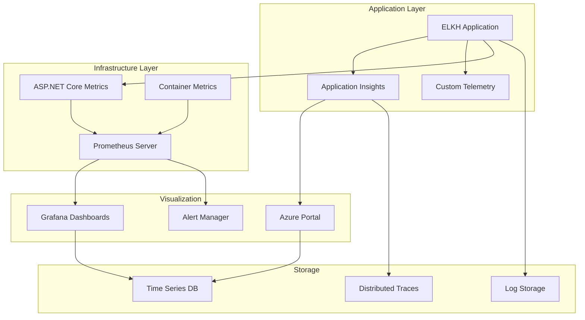

# 📊 ELKH Monitoring & Maintenance Guide

This guide covers the comprehensive monitoring, alerting, and maintenance procedures for ELKH, including Application Insights integration, Prometheus metrics, and troubleshooting workflows.

## 🎯 Monitoring Overview

### Monitoring Stack


### Key Monitoring Components
- **Application Insights** - Microsoft's APM solution for .NET applications
- **Prometheus** - Time-series monitoring and alerting toolkit
- **Grafana** - Visualization and dashboard platform
- **Custom Telemetry Processors** - Business-specific metrics collection
- **Health Checks** - Application and dependency health monitoring

## 🔍 Application Insights Configuration

### Setup and Configuration
```csharp
// Program.cs - Application Insights setup
builder.Services.AddApplicationInsightsTelemetry(options =>
{
    options.InstrumentationKey = builder.Configuration["ApplicationInsights:InstrumentationKey"];
    options.EnableAdaptiveSampling = true;
    options.EnablePerformanceCounterCollectionModule = true;
    options.EnableEventCounterCollectionModule = true;
});

// Custom telemetry processors
builder.Services.AddSingleton<ITelemetryProcessor, PerformanceEnrichmentProcessor>();
builder.Services.AddSingleton<ITelemetryProcessor, SensitiveDataFilterProcessor>();
```

### Custom Telemetry Processors

#### PerformanceEnrichmentProcessor Features
- **Request Categorization** - API, Admin, Authentication, Commerce, etc.
- **Performance Tiers** - Excellent (<100ms), Good (<300ms), Fair (<1s), Poor (<3s), Critical (>3s)
- **Business Context** - Critical operations, user context, response size classification
- **Dependency Analysis** - Database, cache, external service performance tracking

#### Key Metrics Collected
```csharp
// Business Metrics
request.Properties["RequestCategory"] = "Commerce";
request.Properties["BusinessCritical"] = "true";
request.Properties["PerformanceTier"] = "Excellent";

// User Context
request.Properties["HasUserContext"] = "true";
request.Properties["UserRole"] = "Customer";

// Technical Metrics  
dependency.Properties["DependencyCategory"] = "Database";
dependency.Properties["SlowQuery"] = "true";
dependency.Properties["CriticalExternal"] = "true";
```

### Application Insights Queries

#### Performance Analysis
```kusto
// Average response times by endpoint
requests
| where timestamp > ago(1h)
| summarize avg(duration), count() by name
| order by avg_duration desc

// Slow database queries
dependencies
| where type == "SQL" and duration > 1000
| project timestamp, target, data, duration
| order by timestamp desc

// Error rate analysis
requests
| where timestamp > ago(1h)
| summarize total=count(), errors=countif(success == false) by bin(timestamp, 5m)
| extend error_rate = (errors * 100.0) / total
```

#### Business Intelligence Queries
```kusto
// Order conversion funnel
customEvents
| where timestamp > ago(24h)
| where name in ("cart_add", "checkout_start", "order_complete")
| summarize count() by name, bin(timestamp, 1h)
| render timechart

// User activity patterns
pageViews
| where timestamp > ago(7d)
| extend hour = datetime_part("hour", timestamp)
| summarize sessions=dcount(session_Id) by hour
| render columnchart

// Revenue tracking
customEvents
| where name == "order_complete"
| extend revenue = todouble(customMeasurements["order_total"])
| summarize total_revenue=sum(revenue) by bin(timestamp, 1d)
| render timechart
```

## 🏗️ Prometheus Configuration

### Prometheus Server Setup
```yaml
# monitoring/prometheus/prometheus.yml
global:
  scrape_interval: 15s
  evaluation_interval: 15s

rule_files:
  - "alert.rules.yml"
  - "recording.rules.yml"

scrape_configs:
  - job_name: 'elkh-app'
    static_configs:
      - targets: ['elkh-app:8080']
    metrics_path: '/metrics'
    scrape_interval: 10s
    
  - job_name: 'aspnetcore'
    static_configs:
      - targets: ['elkh-app:8080']
    metrics_path: '/metrics'
    scrape_interval: 15s

  - job_name: 'docker'
    static_configs:
      - targets: ['host.docker.internal:9323']

alerting:
  alertmanagers:
    - static_configs:
        - targets: ['alertmanager:9093']
```

### Recording Rules
```yaml
# monitoring/prometheus/recording.rules.yml
groups:
  - name: elkh.performance
    interval: 30s
    rules:
      - record: elkh:request_duration_seconds:rate5m
        expr: rate(http_request_duration_seconds_sum[5m]) / rate(http_request_duration_seconds_count[5m])
        
      - record: elkh:request_rate:rate5m
        expr: rate(http_requests_total[5m])
        
      - record: elkh:error_rate:rate5m
        expr: rate(http_requests_total{status=~"5.."}[5m]) / rate(http_requests_total[5m])

  - name: elkh.business
    interval: 1m
    rules:
      - record: elkh:orders_per_minute
        expr: rate(elkh_orders_total[1m]) * 60
        
      - record: elkh:revenue_per_minute  
        expr: rate(elkh_revenue_total[1m]) * 60
        
      - record: elkh:cart_conversion_rate
        expr: rate(elkh_orders_total[5m]) / rate(elkh_cart_additions_total[5m])
```

### Alert Rules
```yaml
# monitoring/prometheus/alert.rules.yml
groups:
  - name: elkh.critical
    rules:
      - alert: ApplicationDown
        expr: up{job="elkh-app"} == 0
        for: 1m
        labels:
          severity: critical
        annotations:
          summary: "ELKH application is down"
          description: "The ELKH application has been down for more than 1 minute"

      - alert: HighErrorRate
        expr: elkh:error_rate:rate5m > 0.05
        for: 2m
        labels:
          severity: warning
        annotations:
          summary: "High error rate detected"
          description: "Error rate is {{ $value | humanizePercentage }} for the last 5 minutes"

      - alert: SlowResponseTime
        expr: elkh:request_duration_seconds:rate5m > 2
        for: 3m
        labels:
          severity: warning
        annotations:
          summary: "Slow response times"
          description: "Average response time is {{ $value }}s for the last 5 minutes"

  - name: elkh.business
    rules:
      - alert: LowOrderRate
        expr: elkh:orders_per_minute < 1
        for: 10m
        labels:
          severity: warning
        annotations:
          summary: "Low order rate detected"
          description: "Order rate has been below 1 order/minute for 10 minutes"

      - alert: DatabaseConnectivity
        expr: up{job="database"} == 0
        for: 30s
        labels:
          severity: critical
        annotations:
          summary: "Database connectivity lost"
          description: "Cannot connect to the database"
```

## 📈 Grafana Dashboards

### ELKH Application Dashboard
```json
// grafana/dashboards/elkh-application.json
{
  "dashboard": {
    "title": "ELKH Application Monitoring",
    "panels": [
      {
        "title": "Request Rate",
        "targets": [
          {
            "expr": "elkh:request_rate:rate5m",
            "legendFormat": "Requests/sec"
          }
        ],
        "type": "graph"
      },
      {
        "title": "Response Times",
        "targets": [
          {
            "expr": "elkh:request_duration_seconds:rate5m",
            "legendFormat": "Average Response Time"
          },
          {
            "expr": "histogram_quantile(0.95, rate(http_request_duration_seconds_bucket[5m]))",
            "legendFormat": "95th Percentile"
          }
        ],
        "type": "graph"
      },
      {
        "title": "Error Rate",
        "targets": [
          {
            "expr": "elkh:error_rate:rate5m * 100",
            "legendFormat": "Error Rate %"
          }
        ],
        "type": "singlestat"
      }
    ]
  }
}
```

### Business Metrics Dashboard
```json
// grafana/dashboards/elkh-business.json
{
  "dashboard": {
    "title": "ELKH Business Metrics",
    "panels": [
      {
        "title": "Orders per Hour",
        "targets": [
          {
            "expr": "elkh:orders_per_minute * 60",
            "legendFormat": "Orders/hour"
          }
        ],
        "type": "graph"
      },
      {
        "title": "Revenue Tracking",
        "targets": [
          {
            "expr": "elkh:revenue_per_minute * 60",
            "legendFormat": "Revenue/hour"
          }
        ],
        "type": "graph"
      },
      {
        "title": "Conversion Rate",
        "targets": [
          {
            "expr": "elkh:cart_conversion_rate * 100",
            "legendFormat": "Cart to Order %"
          }
        ],
        "type": "singlestat"
      }
    ]
  }
}
```

## 🏥 Health Checks

### Health Check Implementation
```csharp
// Program.cs - Health checks configuration
builder.Services.AddHealthChecks()
    .AddDbContextCheck<ApplicationDbContext>()
    .AddCheck<EmailHealthCheck>("email")
    .AddCheck<SearchIndexHealthCheck>("search_index")
    .AddCheck<CacheHealthCheck>("memory_cache")
    .AddCheck<FileSystemHealthCheck>("file_system");

// Configure health check endpoints
app.MapHealthChecks("/health", new HealthCheckOptions
{
    ResponseWriter = UIResponseWriter.WriteHealthCheckUIResponse
});

app.MapHealthChecks("/health/ready", new HealthCheckOptions
{
    Predicate = check => check.Tags.Contains("ready"),
    ResponseWriter = UIResponseWriter.WriteHealthCheckUIResponse
});

app.MapHealthChecks("/health/live", new HealthCheckOptions
{
    Predicate = _ => false,
    ResponseWriter = UIResponseWriter.WriteHealthCheckUIResponse
});
```

### Custom Health Checks
```csharp
// Health/EmailHealthCheck.cs
public class EmailHealthCheck : IHealthCheck
{
    private readonly IEmailService _emailService;

    public EmailHealthCheck(IEmailService emailService)
    {
        _emailService = emailService;
    }

    public async Task<HealthCheckResult> CheckHealthAsync(
        HealthCheckContext context, 
        CancellationToken cancellationToken = default)
    {
        try
        {
            var isHealthy = await _emailService.TestConnectionAsync();
            
            return isHealthy 
                ? HealthCheckResult.Healthy("Email service is responsive")
                : HealthCheckResult.Degraded("Email service is slow");
        }
        catch (Exception ex)
        {
            return HealthCheckResult.Unhealthy("Email service is unavailable", ex);
        }
    }
}
```

### Health Check Monitoring
```yaml
# Health check Prometheus scraping
- job_name: 'elkh-health'
  static_configs:
    - targets: ['elkh-app:8080']
  metrics_path: '/health/prometheus'
  scrape_interval: 30s
```

## 🔧 Performance Monitoring

### Key Performance Indicators (KPIs)

#### Application Performance
- **Response Time**: Average < 300ms, 95th percentile < 1s
- **Throughput**: Requests per second capacity
- **Error Rate**: < 1% for 4xx errors, < 0.1% for 5xx errors
- **Availability**: 99.9% uptime target

#### Business Performance
- **Order Conversion**: Cart-to-order conversion rate
- **Search Performance**: Search response time < 100ms
- **Image Loading**: Image optimization effectiveness
- **User Engagement**: Session duration and page views

### Performance Optimization Monitoring
```csharp
// Custom performance metrics
public class PerformanceMetrics
{
    private readonly Counter _requestCounter;
    private readonly Histogram _responseTimeHistogram;
    private readonly Counter _businessEventCounter;

    public PerformanceMetrics()
    {
        _requestCounter = Metrics.CreateCounter(
            "elkh_requests_total", 
            "Total HTTP requests",
            new[] { "method", "endpoint", "status" });

        _responseTimeHistogram = Metrics.CreateHistogram(
            "elkh_request_duration_seconds",
            "HTTP request duration in seconds",
            new[] { "method", "endpoint" });

        _businessEventCounter = Metrics.CreateCounter(
            "elkh_business_events_total",
            "Business events counter",
            new[] { "event_type", "category" });
    }

    public void RecordRequest(string method, string endpoint, int statusCode, double duration)
    {
        _requestCounter.WithTags(method, endpoint, statusCode.ToString()).Inc();
        _responseTimeHistogram.WithTags(method, endpoint).Observe(duration);
    }

    public void RecordBusinessEvent(string eventType, string category)
    {
        _businessEventCounter.WithTags(eventType, category).Inc();
    }
}
```

## 🚨 Alerting and Incident Response

### Alert Severity Levels
- **Critical** - Service unavailable, data loss, security breach
- **Warning** - Performance degradation, elevated error rates
- **Info** - Deployment notifications, maintenance windows

### Incident Response Procedures

#### Critical Incident (Service Down)
1. **Immediate Response** (0-5 minutes)
   ```bash
   # Check application health
   curl -f https://elkh.example.com/health || echo "Application Down"
   
   # Check container status
   docker-compose ps
   
   # Check recent logs
   docker-compose logs --tail=50 elkh-app
   ```

2. **Assessment** (5-15 minutes)
   ```bash
   # Check Prometheus alerts
   curl -s http://prometheus:9090/api/v1/alerts
   
   # Review Application Insights
   # Navigate to Azure Portal > Application Insights > Live Metrics
   
   # Check database connectivity
   docker-compose exec elkh-app dotnet ef database update --dry-run
   ```

3. **Resolution** (15-30 minutes)
   ```bash
   # Restart services
   docker-compose restart elkh-app
   
   # Scale up resources
   docker-compose up --scale elkh-app=3
   
   # Rollback if needed
   kubectl rollout undo deployment/elkh-app -n elkh
   ```

#### Performance Degradation
1. **Investigation**
   ```kusto
   // Slow requests analysis
   requests
   | where timestamp > ago(1h) and duration > 1000
   | summarize count() by bin(timestamp, 5m), name
   | render timechart
   
   // Database performance
   dependencies  
   | where type == "SQL" and duration > 500
   | top 10 by duration desc
   ```

2. **Optimization Actions**
   ```bash
   # Clear application cache
   curl -X POST https://elkh.example.com/admin/cache/clear
   
   # Restart search indexing
   curl -X POST https://elkh.example.com/admin/search/reindex
   
   # Database optimization
   docker-compose exec db sqlite3 elkh.db ".analyze"
   ```

### Alert Notification Channels
```yaml
# Alert Manager configuration
route:
  group_by: ['alertname']
  group_wait: 10s
  group_interval: 10s
  repeat_interval: 1h
  receiver: 'web.hook'
  routes:
  - match:
      severity: critical
    receiver: 'critical-alerts'
  - match:
      severity: warning
    receiver: 'warning-alerts'

receivers:
- name: 'critical-alerts'
  email_configs:
  - to: 'admin@elkh.com'
    subject: '[CRITICAL] ELKH Alert'
    body: |
      Alert: {{ .GroupLabels.alertname }}
      Description: {{ .CommonAnnotations.description }}
      
- name: 'warning-alerts'
  slack_configs:
  - api_url: 'https://hooks.slack.com/services/YOUR/SLACK/WEBHOOK'
    channel: '#elkh-alerts'
    title: 'ELKH Warning Alert'
```

## 🛠️ Maintenance Procedures

### Routine Maintenance Tasks

#### Daily Maintenance
```bash
#!/bin/bash
# scripts/daily-maintenance.sh

echo "ELKH Daily Maintenance - $(date)"

# Check application health
curl -f https://elkh.example.com/health/ready

# Monitor disk usage
df -h | grep -E "(root|data)"

# Check error logs
docker-compose logs --since=24h elkh-app | grep -i error | wc -l

# Database maintenance
docker-compose exec elkh-app dotnet ef database update --dry-run

# Performance metrics summary
curl -s http://prometheus:9090/api/v1/query?query=elkh:request_rate:rate5m

echo "Daily maintenance completed"
```

#### Weekly Maintenance
```bash
#!/bin/bash
# scripts/weekly-maintenance.sh

echo "ELKH Weekly Maintenance - $(date)"

# Database vacuum (SQLite optimization)
docker-compose exec db sqlite3 elkh.db "VACUUM; ANALYZE;"

# Clear old logs (keep last 7 days)
docker-compose logs --since=168h elkh-app > /tmp/elkh-logs-backup-$(date +%Y%m%d).log
docker-compose exec elkh-app find /app/logs -name "*.log" -mtime +7 -delete

# Update search index
curl -X POST https://elkh.example.com/admin/search/reindex

# Generate performance report
curl -s "http://prometheus:9090/api/v1/query_range?query=elkh:request_rate:rate5m&start=$(date -d '7 days ago' +%s)&end=$(date +%s)&step=3600" > performance-report-$(date +%Y%m%d).json

echo "Weekly maintenance completed"
```

#### Monthly Maintenance
```bash
#!/bin/bash
# scripts/monthly-maintenance.sh

echo "ELKH Monthly Maintenance - $(date)"

# Backup database
docker-compose exec db sqlite3 elkh.db ".backup /backup/elkh-backup-$(date +%Y%m%d).db"

# Update dependencies (security patches)
docker-compose pull
docker-compose up -d

# Performance analysis
curl -s "http://prometheus:9090/api/v1/query_range?query=elkh:request_duration_seconds:rate5m&start=$(date -d '30 days ago' +%s)&end=$(date +%s)&step=3600" > monthly-performance-$(date +%Y%m%d).json

# Capacity planning metrics
docker stats --no-stream > capacity-metrics-$(date +%Y%m%d).txt

echo "Monthly maintenance completed"
```

### Database Maintenance

#### SQLite Optimization
```sql
-- Database optimization queries
PRAGMA optimize;
PRAGMA integrity_check;
PRAGMA foreign_key_check;

-- Analyze query performance
EXPLAIN QUERY PLAN SELECT * FROM Products WHERE Name LIKE '%search%';

-- Index usage analysis  
SELECT name, sql FROM sqlite_master WHERE type='index';
```

#### Data Cleanup Procedures
```csharp
// Data retention service
public class DataRetentionService : BackgroundService
{
    protected override async Task ExecuteAsync(CancellationToken stoppingToken)
    {
        while (!stoppingToken.IsCancellationRequested)
        {
            await CleanupOldDataAsync();
            await Task.Delay(TimeSpan.FromDays(1), stoppingToken);
        }
    }

    private async Task CleanupOldDataAsync()
    {
        // Clean old logs (90 days)
        await _context.AuditEntries
            .Where(a => a.Timestamp < DateTime.UtcNow.AddDays(-90))
            .ExecuteDeleteAsync();

        // Clean old sessions (30 days)
        await _context.UserSessions
            .Where(s => s.LastAccessed < DateTime.UtcNow.AddDays(-30))
            .ExecuteDeleteAsync();

        // Clean orphaned cart items (7 days)
        await _context.CartItems
            .Where(c => c.CreatedAt < DateTime.UtcNow.AddDays(-7) && c.Cart.UpdatedAt < DateTime.UtcNow.AddDays(-7))
            .ExecuteDeleteAsync();
    }
}
```

## 🔍 Troubleshooting Guide

### Common Issues and Solutions

#### Application Won't Start
**Symptoms**: Container exits immediately, health checks fail
```bash
# Diagnostics
docker-compose logs elkh-app
docker-compose exec elkh-app dotnet --version

# Solutions
# 1. Check connection strings
docker-compose exec elkh-app printenv | grep ConnectionString

# 2. Verify database migrations
docker-compose exec elkh-app dotnet ef database update --dry-run

# 3. Reset container
docker-compose down
docker-compose up -d --force-recreate elkh-app
```

#### High Memory Usage
**Symptoms**: Container restart, out of memory errors
```bash
# Diagnostics
docker stats elkh-app
curl -s http://prometheus:9090/api/v1/query?query=container_memory_usage_bytes

# Solutions
# 1. Increase container memory limits
# In docker-compose.yml:
services:
  elkh-app:
    deploy:
      resources:
        limits:
          memory: 2G

# 2. Clear application cache
curl -X POST https://elkh.example.com/admin/cache/clear

# 3. Restart application
docker-compose restart elkh-app
```

#### Database Connection Issues
**Symptoms**: SQL connection timeout, database locked errors
```bash
# Diagnostics
docker-compose exec elkh-app dotnet ef database update --dry-run
sqlite3 /data/elkh.db ".schema"

# Solutions
# 1. Check database file permissions
docker-compose exec elkh-app ls -la /data/

# 2. Restart database connection pool
docker-compose restart elkh-app

# 3. Database recovery
docker-compose exec elkh-app sqlite3 /data/elkh.db ".recover"
```

#### Performance Issues
**Symptoms**: Slow response times, high CPU usage
```bash
# Diagnostics
curl -w "@curl-format.txt" -s -o /dev/null https://elkh.example.com/
docker-compose exec elkh-app top

# Solutions
# 1. Enable response caching
# Check appsettings.json cache configuration

# 2. Optimize database queries
# Review Application Insights slow query reports

# 3. Scale horizontally
docker-compose up --scale elkh-app=3
```

### Performance Tuning Checklist

#### Application Level
- [ ] Response caching enabled
- [ ] Database connection pooling optimized
- [ ] Async/await patterns used throughout
- [ ] Image optimization configured
- [ ] Static file compression enabled

#### Database Level
- [ ] Appropriate indexes created
- [ ] Query performance analyzed
- [ ] Database statistics updated
- [ ] Connection pool size tuned

#### Infrastructure Level
- [ ] Container resource limits set
- [ ] Health checks configured
- [ ] Load balancing enabled
- [ ] CDN for static assets

## 📊 Monitoring Dashboard URLs

### Development Environment
- **Application**: http://localhost:5000
- **Health Checks**: http://localhost:5000/health
- **Prometheus**: http://localhost:9090
- **Grafana**: http://localhost:3000

### Production Environment
- **Application**: https://elkh.example.com
- **Health Checks**: https://elkh.example.com/health
- **Prometheus**: https://monitoring.elkh.example.com:9090
- **Grafana**: https://grafana.elkh.example.com
- **Application Insights**: Azure Portal > Application Insights

## 📚 Related Documentation

- **[Architecture Guide](ARCHITECTURE.md)** - System design and monitoring architecture
- **[Deployment Guide](DEPLOYMENT.md)** - Docker and Azure deployment with monitoring
- **[API Documentation](API.md)** - Health check endpoints and metrics APIs
- **[Contributing Guidelines](CONTRIBUTING.md)** - Development workflow including monitoring practices

---

*For monitoring support or escalation, refer to the incident response procedures and contact the on-call engineer through the configured alert channels.*