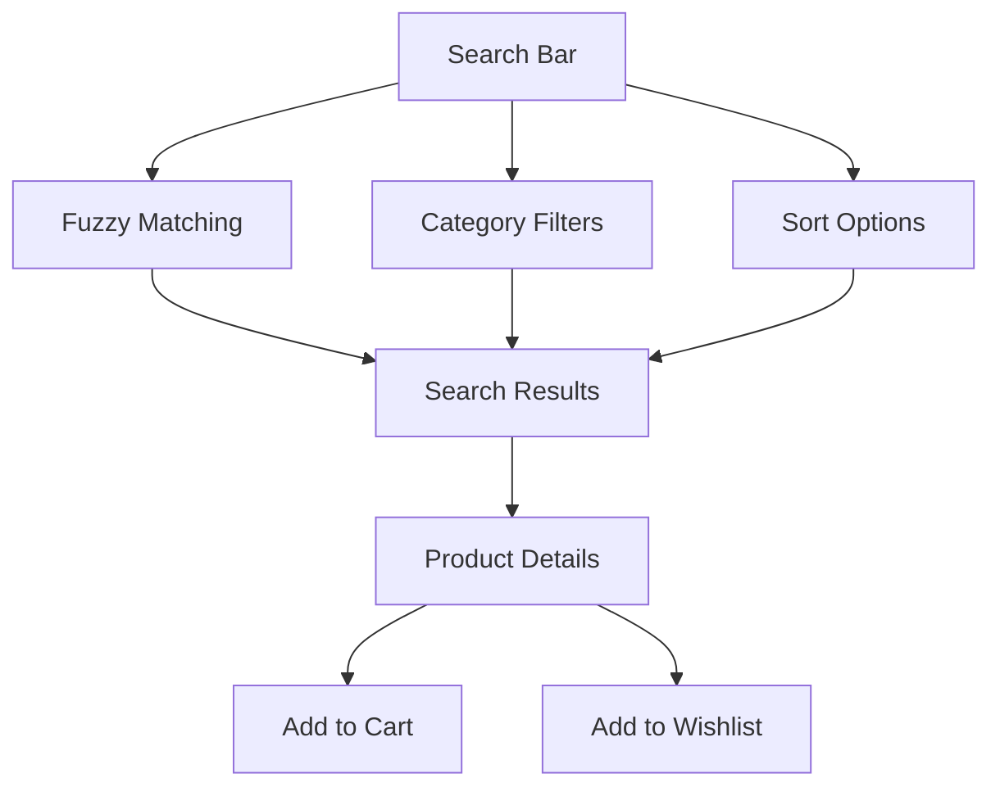
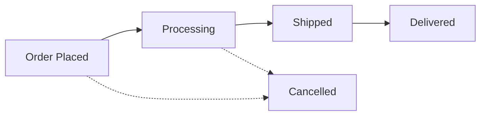
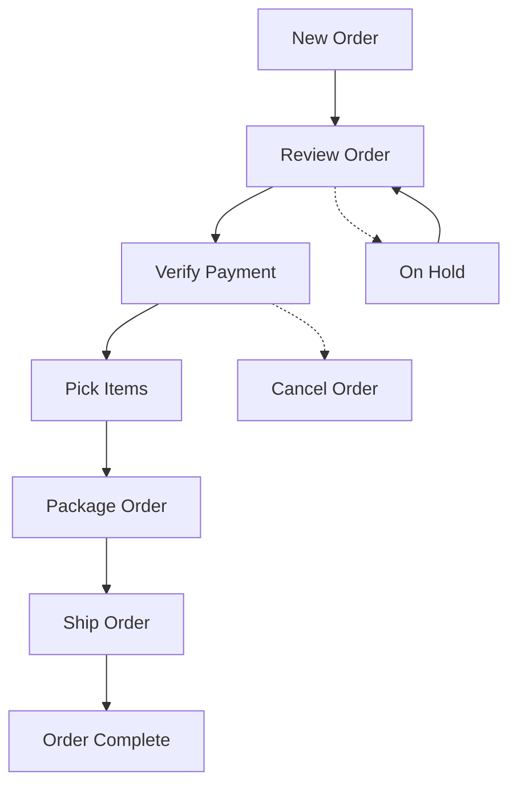
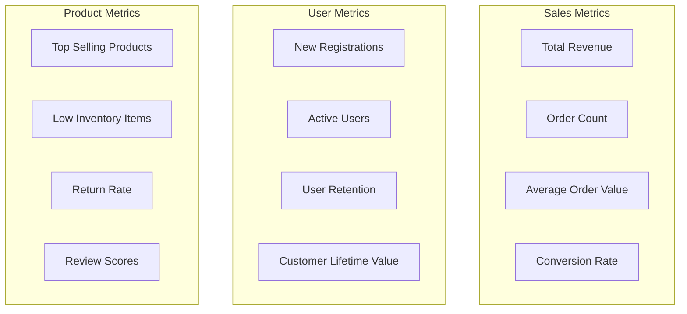
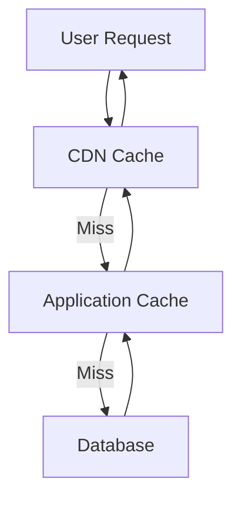

# 👥 ELKH User Guide

Welcome to ELKH, your premium sticker e-commerce platform! This comprehensive guide will help you navigate and use all the features available to customers, staff, and administrators.

## 🎯 Quick Navigation

- **[🛒 Customer Guide](#-customer-guide)** - Shopping, account management, and orders
- **[👨‍💼 Staff Guide](#-staff-guide)** - Order management and customer support
- **[🔧 Admin Guide](#-admin-guide)** - System administration and analytics
- **[📱 Platform Features](#-platform-features)** - Core functionality overview

---

## 🛒 Customer Guide

### Getting Started

#### Account Registration
1. **Visit Registration Page** - Click "Sign Up" in the top navigation
2. **Fill Account Details**:
   ```
   - Full Name: Your display name
   - Email Address: Primary contact email
   - Password: Strong password (8+ characters)
   - Confirm Password: Repeat your password
   ```
3. **Email Verification** - Check your inbox and click the verification link
4. **Complete Profile** - Add optional profile information

#### Account Login
1. **Access Login Page** - Click "Sign In" or visit `/Account/Login`
2. **Enter Credentials** - Email and password
3. **Remember Me** - Check for persistent login (optional)
4. **Forgot Password** - Use password reset if needed

### Product Browsing and Search

#### Advanced Search Features


#### Search Techniques
- **Basic Search**: Type product name or keywords
- **Fuzzy Search**: Finds products even with typos (e.g., "stiker" → "sticker")
- **Category Filtering**: Use sidebar filters to narrow results
- **Price Range**: Set minimum and maximum price filters
- **Sorting Options**: 
  - Relevance (default)
  - Price: Low to High
  - Price: High to Low
  - Newest First
  - Customer Rating

### Shopping Cart Management

#### Adding Items to Cart
1. **Product Page** - Select quantity and click "Add to Cart"
2. **Bulk Actions** - Use category pages for multiple items
3. **Quick Add** - Use search results for fast adding

#### Cart Operations
```
Cart Features:
├── Update Quantities - Change item quantities
├── Remove Items - Delete unwanted products
├── Save for Later - Move to wishlist
├── Apply Coupons - Enter discount codes
├── Shipping Calculator - Estimate shipping costs
└── Guest Checkout - Purchase without account
```

#### Checkout Process
1. **Review Cart** - Verify items and quantities
2. **Shipping Information**:
   ```
   - Shipping Address
   - Billing Address (if different)
   - Delivery Preferences
   ```
3. **Payment Method**:
   ```
   - Credit/Debit Card
   - PayPal (if enabled)
   - Store Credit (if available)
   ```
4. **Order Review** - Final confirmation before purchase
5. **Payment Processing** - Secure transaction processing
6. **Order Confirmation** - Receive confirmation email

### Order Management

#### Order History
- **Access**: User Dashboard → "My Orders"
- **Order Details**: Click any order to view full information
- **Order Status Tracking**: Real-time status updates
- **Reorder**: Quickly reorder previous purchases

#### Order Status Workflow


### User Profile Management

#### Profile Dashboard
**Access**: Click your name in top navigation → "Dashboard"

**Available Sections**:
- **Profile Overview** - Quick stats and recent activity
- **Personal Information** - Update name, email, phone
- **Address Book** - Manage shipping and billing addresses
- **Order History** - Past purchases and status
- **Wishlist** - Saved products for later
- **Reviews** - Product reviews you've written
- **Account Settings** - Password, preferences, notifications

#### Address Book Management
1. **Add New Address**:
   ```
   - Address Label (Home, Work, etc.)
   - Full Name
   - Street Address (Line 1 & 2)
   - City, State/Province
   - ZIP/Postal Code
   - Country
   - Phone Number
   ```
2. **Set Default Address** - Mark primary shipping/billing address
3. **Edit/Delete** - Manage existing addresses
4. **Address Validation** - System validates address format

#### Profile Customization
- **Avatar Upload** - Personal profile picture
- **Display Preferences** - Theme, language, timezone
- **Email Notifications** - Marketing, order updates, newsletters
- **Privacy Settings** - Data sharing preferences

### Product Reviews and Ratings

#### Writing Product Reviews
1. **Purchase Required** - Must have purchased the product
2. **Review Form**:
   ```
   - Star Rating (1-5 stars)
   - Review Title
   - Detailed Review
   - Photo Upload (optional)
   ```
3. **Review Guidelines**:
   - Be honest and helpful
   - Focus on product quality
   - Avoid personal information
   - Respect community standards

#### Store Testimonials
- **Write Testimonial** - Share overall store experience
- **Public Display** - Testimonials appear on homepage
- **Moderation** - Reviews are moderated before publishing

---

## 👨‍💼 Staff Guide

### Staff Dashboard Access

#### Login Process
1. **Staff Login Portal** - `/Account/StaffLogin`
2. **Credentials** - Use provided staff email and password
3. **Role Verification** - System confirms staff privileges
4. **Dashboard Access** - Redirected to staff dashboard

#### Dashboard Overview
```
Staff Dashboard:
├── Order Management - Process customer orders
├── Customer Support - Handle inquiries and issues
├── Inventory Alerts - Low stock notifications
├── Daily Reports - Sales and performance metrics
├── Quick Actions - Common staff tasks
└── System Status - Health and performance indicators
```

### Order Management

#### Order Processing Workflow
1. **New Orders Queue** - View all pending orders
2. **Order Details Review**:
   ```
   - Customer Information
   - Shipping Address
   - Payment Status
   - Product Details
   - Special Instructions
   ```
3. **Inventory Verification** - Confirm product availability
4. **Order Fulfillment**:
   - Mark items as picked
   - Package preparation
   - Shipping label generation
   - Tracking number assignment
5. **Status Updates** - Update order status and notify customer

#### Order Status Management


### Customer Support

#### Support Dashboard
- **Active Inquiries** - Current customer support tickets
- **Response Templates** - Pre-written responses for common issues
- **Customer History** - View customer order and interaction history
- **Escalation Process** - Escalate complex issues to management

#### Common Support Scenarios
1. **Order Issues**:
   - Shipping delays
   - Damaged products
   - Incorrect orders
   - Refund requests

2. **Account Problems**:
   - Password resets
   - Email changes
   - Account lockouts
   - Profile updates

3. **Technical Issues**:
   - Website problems
   - Checkout failures
   - Search issues
   - Performance concerns

#### Support Response Guidelines
- **Response Time**: Within 2 hours during business hours
- **Tone**: Professional, helpful, and empathetic
- **Documentation**: Log all interactions in customer record
- **Follow-up**: Ensure issue resolution satisfaction

### Inventory Management

#### Stock Level Monitoring
- **Low Stock Alerts** - Automatic notifications when inventory is low
- **Stock Reports** - Daily, weekly, and monthly inventory reports
- **Reorder Recommendations** - Suggested reorder quantities
- **Product Performance** - Best/worst selling products

#### Inventory Actions
- **Update Stock Levels** - Manual stock adjustments
- **Product Information** - Update descriptions, prices, images
- **Category Management** - Organize products into categories
- **Bulk Operations** - Mass updates for multiple products

---

## 🔧 Admin Guide

### Admin Dashboard

#### Administrative Access
**URL**: `/Admin/Dashboard`
**Required Role**: Admin or Manager

**Main Sections**:
```
Admin Dashboard:
├── User Management - Manage customer and staff accounts
├── Analytics & Reports - Business intelligence and metrics
├── System Management - Cache, search, health monitoring  
├── Order Analytics - Sales performance and trends
├── Product Management - Catalog administration
├── Security & Audit - Access logs and security events
└── Configuration - System settings and preferences
```

### User Administration

#### User Management Interface
**Access**: Admin Dashboard → User Management

**Available Actions**:
- **View All Users** - Paginated list of all registered users
- **Search Users** - Find users by email, name, or ID
- **User Details** - Comprehensive user profile information
- **Role Management** - Assign and modify user roles
- **Account Status** - Enable, disable, or lock accounts
- **Activity History** - View user login and activity logs

#### Role Management
```
User Roles Hierarchy:
├── Admin - Full system access
├── Manager - User and order management
├── Staff - Order processing and customer support
└── Customer - Shopping and account management
```

#### User Account Operations
1. **Create New User Account**:
   ```
   - Basic Information (Name, Email)
   - Role Assignment
   - Initial Password (temporary)
   - Account Status (Active/Inactive)
   ```

2. **Modify Existing Account**:
   - Update personal information
   - Change role assignments
   - Reset passwords
   - Update account status

3. **Account Security**:
   - Force password reset
   - Enable/disable two-factor authentication
   - Review login history
   - Lock/unlock accounts

### Sales Analytics and Business Intelligence

#### Analytics Dashboard
**Access**: Admin Dashboard → Analytics

#### Key Metrics


#### Report Types
1. **Sales Reports**:
   - Daily, weekly, monthly revenue
   - Product performance analysis
   - Category sales comparison
   - Geographic sales distribution

2. **User Reports**:
   - Registration trends
   - User activity patterns
   - Customer segmentation
   - Retention analysis

3. **Performance Reports**:
   - Website traffic analysis
   - Conversion funnel metrics
   - Search performance
   - Cart abandonment rates

#### Exporting Data
- **CSV Export** - Download reports for external analysis
- **PDF Reports** - Formatted reports for presentations
- **API Access** - Programmatic data access for integration
- **Scheduled Reports** - Automated report delivery

### System Management

#### System Administration
**Access**: Admin Dashboard → System Management

#### Available Tools
1. **Cache Management**:
   ```
   - View Cache Statistics
   - Clear All Cache
   - Clear Specific Cache Keys
   - Cache Performance Metrics
   ```

2. **Search Index Management**:
   ```
   - Rebuild Search Index
   - Index Status and Statistics
   - Search Performance Metrics
   - Index Optimization
   ```

3. **Health Monitoring**:
   ```
   - System Health Overview
   - Database Connectivity
   - External Service Status
   - Performance Indicators
   ```

4. **Configuration Management**:
   ```
   - Application Settings
   - Email Configuration
   - Payment Gateway Settings
   - Security Policies
   ```

#### Maintenance Operations
- **Database Optimization** - Run database maintenance tasks
- **Log Management** - View and manage application logs
- **Backup Status** - Monitor backup operations
- **System Updates** - Manage application updates

### Security and Audit

#### Security Dashboard
- **Active Sessions** - Monitor logged-in users
- **Failed Login Attempts** - Security threat monitoring
- **Administrative Actions** - Audit log of admin activities
- **System Alerts** - Security-related notifications

#### Audit Trail
All administrative actions are logged with:
```
Audit Entry:
├── Timestamp - When action occurred
├── User - Who performed the action
├── Action Type - What was done
├── Target - What was affected
├── IP Address - Source of the action
├── User Agent - Browser/device information
└── Result - Success or failure
```

---

## 📱 Platform Features

### Advanced Search Engine

#### Fuzzy Search Capabilities
The ELKH platform uses advanced fuzzy search that:
- **Handles Typos** - Finds "sticker" even when you type "stiker"
- **Suggests Corrections** - Offers "Did you mean..." suggestions
- **Learns from Usage** - Improves suggestions based on user behavior
- **Multi-language Support** - Handles different languages and character sets

#### Search Optimization Tips
1. **Use Descriptive Terms** - "vintage flower stickers" vs "stickers"
2. **Try Variations** - "kids stickers" or "children's stickers"  
3. **Use Filters** - Combine search with category and price filters
4. **Sort Results** - Use relevance, price, or rating sorting

### Image Processing and Optimization

#### Automatic Image Optimization
- **Multiple Formats** - WebP, JPEG, PNG supported
- **Responsive Sizing** - Images resize for different devices
- **Compression** - Reduced file sizes without quality loss
- **CDN Delivery** - Fast image loading worldwide

#### Image Upload Guidelines (Admin/Staff)
```
Recommended Image Specifications:
├── Format: JPEG or PNG
├── Resolution: 1200x1200 pixels minimum
├── File Size: Under 2MB
├── Aspect Ratio: Square (1:1) preferred
└── Background: Clean, minimal background
```

### Caching and Performance

#### Multi-level Caching System


#### Cache Types
- **CDN Cache** - Static assets (images, CSS, JavaScript)
- **Application Cache** - Frequently accessed data
- **Database Cache** - Query result caching
- **Session Cache** - User session data

### Email System

#### Automated Emails
- **Registration Welcome** - New user greeting
- **Order Confirmation** - Purchase verification
- **Shipping Notification** - Tracking information
- **Delivery Confirmation** - Order completion
- **Password Reset** - Security notifications

#### Email Preferences
Users can control email frequency and types:
```
Email Settings:
├── Marketing Emails - Promotional content
├── Order Updates - Transactional emails
├── Security Alerts - Account security notifications
├── Newsletter - Company news and updates
└── Frequency - Daily, weekly, or monthly
```

### Mobile Responsiveness

#### Responsive Design Features
- **Mobile-First Design** - Optimized for smartphones
- **Touch-Friendly Interface** - Large buttons and easy navigation
- **Fast Loading** - Optimized for mobile networks
- **Offline Capabilities** - Basic functionality without internet

#### Mobile-Specific Features
- **Touch Gestures** - Swipe navigation and pinch zoom
- **Mobile Payments** - Apple Pay, Google Pay support
- **Camera Integration** - Photo reviews and avatar upload
- **Location Services** - Shipping address suggestions

### Security Features

#### Data Protection
- **SSL/TLS Encryption** - All data transmitted securely
- **Password Hashing** - Secure password storage
- **PII Protection** - Personal information safeguards
- **GDPR Compliance** - European privacy standards

#### Account Security
- **Strong Password Requirements** - Enforced complexity
- **Account Lockout** - Protection against brute force attacks
- **Session Management** - Automatic session expiration
- **Security Notifications** - Alerts for suspicious activity

### Integration Capabilities

#### Third-Party Integrations
- **Payment Gateways** - Stripe, PayPal, Square
- **Shipping Providers** - UPS, FedEx, USPS
- **Email Services** - SendGrid, Mailchimp
- **Analytics** - Google Analytics, Application Insights

#### API Access
- **RESTful API** - Programmatic access to data
- **Webhook Support** - Real-time event notifications
- **Rate Limiting** - API usage protection
- **Authentication** - Secure API access

---

## 🆘 Getting Help

### Customer Support

#### Contact Methods
- **Email Support**: support@elkh.com
- **Live Chat**: Available on website during business hours
- **Phone Support**: Call during business hours
- **Help Center**: Comprehensive FAQ and guides

#### Support Hours
```
Support Availability:
├── Monday - Friday: 9:00 AM - 6:00 PM EST
├── Saturday: 10:00 AM - 4:00 PM EST  
├── Sunday: Closed
├── Holiday Hours: Reduced availability
└── Emergency Support: 24/7 for critical issues
```

### Self-Service Resources

#### Help Center Topics
- **Account Management** - Registration, login, profile updates
- **Order Processing** - Placing orders, tracking, returns
- **Product Information** - Search, categories, specifications
- **Payment Issues** - Payment methods, refunds, billing
- **Technical Problems** - Website issues, mobile app, performance

#### Video Tutorials
- **Getting Started** - Platform overview and basic navigation
- **Advanced Search** - Using filters and search techniques
- **Order Management** - Complete order lifecycle
- **Admin Features** - Administrative tools and reports

### Feature Requests and Feedback

#### Feedback Channels
- **Feature Request Form** - Submit new feature ideas
- **Bug Reports** - Report technical issues
- **User Surveys** - Periodic feedback collection
- **Beta Testing** - Early access to new features

#### Community
- **User Forum** - Community discussions and tips
- **Social Media** - Updates and announcements
- **Newsletter** - Monthly platform updates
- **Blog** - Tips, tricks, and best practices

---

## 📚 Quick Reference

### Common Shortcuts
- **Ctrl+F** - Quick search on any page
- **Alt+C** - Jump to cart
- **Alt+A** - Access account menu
- **Alt+H** - Go to homepage
- **Esc** - Close modal dialogs

### URL References
- **Homepage**: `/`
- **Search**: `/Products`
- **Cart**: `/Cart`
- **Account**: `/Account/Dashboard`
- **Orders**: `/Account/Orders`
- **Support**: `/Support`

### Status Codes
- **Order Placed** - Order received and being processed
- **Processing** - Items being picked and packaged
- **Shipped** - Order dispatched with tracking number
- **Delivered** - Order confirmed delivered
- **Cancelled** - Order cancelled at customer or system request

---

*This user guide is regularly updated. For the latest version and additional resources, visit our [Help Center](https://elkh.example.com/help) or contact our support team.*